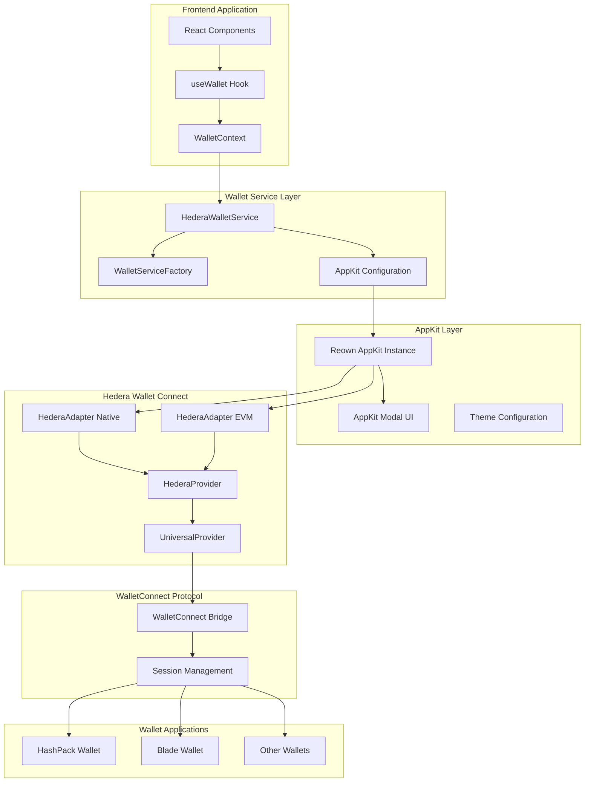
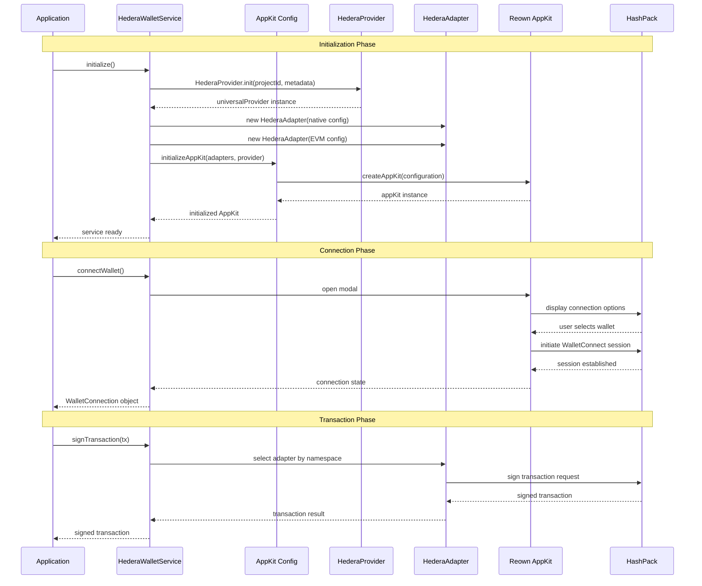
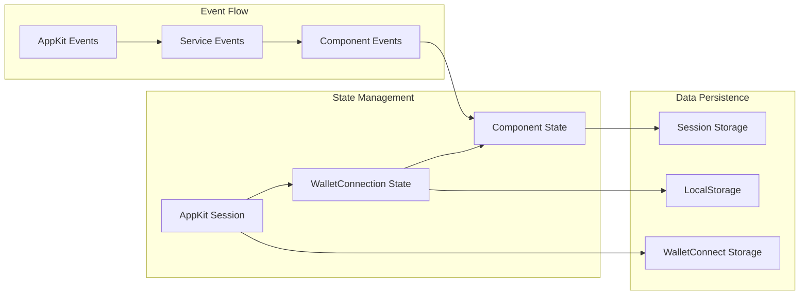

# HederaProvider + AppKit Architecture Documentation

## Table of Contents

1. [Overview](#overview)
2. [Architecture Diagrams](#architecture-diagrams)
3. [Component Roles](#component-roles)
4. [Code Examples](#code-examples)
5. [Differences with DAppConnector](#differences-with-dappconnector)
6. [Troubleshooting Guide](#troubleshooting-guide)
7. [Migration Guide](#migration-guide)

## Overview

This document provides comprehensive architecture documentation for the HederaProvider + AppKit integration in MazaoChain. This integration combines the robust wallet connection capabilities of HederaProvider with the modern UI experience of Reown AppKit, providing a complete solution for Hedera wallet connectivity.

### Key Benefits

- **Modern UI**: Professional, maintained modal interface via AppKit
- **Multi-Namespace Support**: Both Hedera native and EVM transactions
- **Reduced Maintenance**: Less custom UI code to maintain
- **Better UX**: Consistent experience across dApps
- **Robust Architecture**: Proven WalletConnect infrastructure

## Architecture Diagrams

### High-Level System Architecture



### Component Interaction Flow



### Data Flow Architecture



## Component Roles

### HederaProvider

**Primary Role**: Central provider for WalletConnect communication with Hedera wallets

**Responsibilities**:
- Initialize WalletConnect connection with project metadata
- Manage UniversalProvider instance for AppKit compatibility
- Handle low-level WalletConnect protocol communication
- Provide foundation for HederaAdapter instances

**Key Methods**:
```typescript
// Initialize with project configuration
HederaProvider.init({
  projectId: string,
  metadata: AppMetadata
}): Promise<UniversalProvider>
```

**Usage Pattern**:
```typescript
const universalProvider = await HederaProvider.init({
  projectId: env.NEXT_PUBLIC_WALLETCONNECT_PROJECT_ID,
  metadata: {
    name: 'MazaoChain MVP',
    description: 'Decentralized lending platform',
    url: 'https://mazaochain.com',
    icons: ['https://mazaochain.com/favicon.ico']
  }
}) as unknown as UniversalProvider;
```

### HederaAdapter

**Primary Role**: Namespace-specific adapter for transaction handling

**Responsibilities**:
- Provide namespace-specific transaction signing (hedera vs eip155)
- Configure network definitions for each namespace
- Handle adapter-specific wallet communication
- Bridge between AppKit and HederaProvider

**Configuration Examples**:

**Native Hedera Adapter**:
```typescript
const nativeAdapter = new HederaAdapter({
  projectId: env.NEXT_PUBLIC_WALLETCONNECT_PROJECT_ID,
  networks: [
    HederaChainDefinition.Native.Mainnet,
    HederaChainDefinition.Native.Testnet
  ],
  namespace: hederaNamespace // 'hedera'
});
```

**EVM Adapter**:
```typescript
const evmAdapter = new HederaAdapter({
  projectId: env.NEXT_PUBLIC_WALLETCONNECT_PROJECT_ID,
  networks: [
    HederaChainDefinition.EVM.Mainnet,  // Chain ID 295
    HederaChainDefinition.EVM.Testnet   // Chain ID 296
  ],
  namespace: 'eip155'
});
```

**Key Capabilities**:
- Transaction signing for specific namespace
- Network switching within namespace
- Account management per namespace
- Error handling for namespace-specific operations

### Reown AppKit

**Primary Role**: Modern wallet connection UI and session management

**Responsibilities**:
- Provide professional wallet connection modal
- Handle wallet selection and connection flow
- Manage session persistence and restoration
- Provide theme customization and branding
- Handle multi-adapter coordination

**Configuration Structure**:
```typescript
const appKit = createAppKit({
  // Multi-adapter support
  adapters: [evmAdapter, nativeAdapter],
  
  // Provider from HederaProvider
  universalProvider: hederaProvider,
  
  // WalletConnect configuration
  projectId: env.NEXT_PUBLIC_WALLETCONNECT_PROJECT_ID,
  
  // Application metadata
  metadata: AppMetadata,
  
  // Supported networks
  networks: HederaChainDefinition[],
  
  // Feature configuration
  features: {
    analytics: false,
    email: false,
    socials: []
  },
  
  // Theme customization
  themeMode: 'light',
  themeVariables: ThemeVariables
});
```

**Key Features**:
- Modal-based wallet selection
- Automatic session restoration
- Multi-wallet support
- Theme customization
- Event-driven architecture

### HederaWalletService

**Primary Role**: Service layer orchestrating all wallet operations

**Responsibilities**:
- Coordinate HederaProvider, adapters, and AppKit
- Implement IWalletService interface
- Manage connection state and session persistence
- Handle error translation and user feedback
- Provide transaction signing abstraction

**Architecture Pattern**:
```typescript
class HederaWalletService implements IWalletService {
  private hederaProvider: HederaProvider | null = null;
  private nativeAdapter: HederaAdapter | null = null;
  private evmAdapter: HederaAdapter | null = null;
  private appKitInstance: any = null;
  private connectionState: WalletConnection | null = null;
  
  // Initialization orchestration
  async initialize(): Promise<void>
  
  // Connection management
  async connectWallet(namespace?: string): Promise<WalletConnection>
  async disconnectWallet(): Promise<void>
  
  // Transaction operations
  async signTransaction(transaction: Transaction): Promise<Transaction>
  async signMessage(message: string): Promise<string>
  
  // State management
  getConnectionState(): WalletConnection | null
  isConnected(): boolean
}
```

## Code Examples

### Complete Initialization Example

```typescript
// src/lib/wallet/hedera-wallet.ts
import { HederaProvider, HederaAdapter, HederaChainDefinition, hederaNamespace } from '@hashgraph/hedera-wallet-connect';
import { createAppKit } from '@reown/appkit';
import type UniversalProvider from '@walletconnect/universal-provider';

export class HederaWalletService implements IWalletService {
  private hederaProvider: HederaProvider | null = null;
  private nativeAdapter: HederaAdapter | null = null;
  private evmAdapter: HederaAdapter | null = null;
  private appKitInstance: any = null;

  async initialize(): Promise<void> {
    try {
      // 1. Validate configuration
      if (!env.NEXT_PUBLIC_WALLETCONNECT_PROJECT_ID) {
        throw new WalletError(
          WalletErrorCode.INVALID_PROJECT_ID,
          "WalletConnect Project ID is required"
        );
      }

      // 2. Prepare metadata
      const metadata = {
        name: env.NEXT_PUBLIC_HASHPACK_APP_NAME || "MazaoChain MVP",
        description: env.NEXT_PUBLIC_HASHPACK_APP_DESCRIPTION || "Decentralized lending platform",
        url: env.NEXT_PUBLIC_APP_URL || "http://localhost:3000",
        icons: [`${env.NEXT_PUBLIC_APP_URL}/favicon.ico`],
      };

      // 3. Initialize HederaProvider
      this.hederaProvider = (await HederaProvider.init({
        projectId: env.NEXT_PUBLIC_WALLETCONNECT_PROJECT_ID,
        metadata,
      })) as unknown as UniversalProvider;

      // 4. Create Native Adapter
      this.nativeAdapter = new HederaAdapter({
        projectId: env.NEXT_PUBLIC_WALLETCONNECT_PROJECT_ID,
        networks: [
          HederaChainDefinition.Native.Mainnet,
          HederaChainDefinition.Native.Testnet,
        ],
        namespace: hederaNamespace,
      });

      // 5. Create EVM Adapter
      this.evmAdapter = new HederaAdapter({
        projectId: env.NEXT_PUBLIC_WALLETCONNECT_PROJECT_ID,
        networks: [
          HederaChainDefinition.EVM.Mainnet,
          HederaChainDefinition.EVM.Testnet,
        ],
        namespace: 'eip155',
      });

      // 6. Initialize AppKit
      this.appKitInstance = createAppKit({
        adapters: [this.evmAdapter, this.nativeAdapter],
        //@ts-expect-error expected type error due to private properties
        universalProvider: this.hederaProvider,
        projectId: env.NEXT_PUBLIC_WALLETCONNECT_PROJECT_ID,
        metadata,
        networks: [
          HederaChainDefinition.EVM.Mainnet,
          HederaChainDefinition.EVM.Testnet,
          HederaChainDefinition.Native.Mainnet,
          HederaChainDefinition.Native.Testnet,
        ],
        features: {
          analytics: false,
          email: false,
          socials: [],
        },
        themeMode: "light",
        themeVariables: {
          "--w3m-accent": "#10b981",
          "--w3m-background": "#ffffff",
          "--w3m-foreground": "#000000",
          "--w3m-border-radius-master": "8px",
        },
      });

      // 7. Setup event listeners
      this.setupEventListeners();

      // 8. Restore existing session
      await this.restoreSession();

      this.isInitialized = true;
    } catch (error) {
      throw new WalletError(
        WalletErrorCode.INITIALIZATION_FAILED,
        "Failed to initialize wallet service",
        error
      );
    }
  }
}
```

### Connection Flow Example

```typescript
async connectWallet(namespace: "hedera" | "eip155" = "hedera"): Promise<WalletConnection> {
  if (!this.isInitialized) {
    await this.initialize();
  }

  try {
    // Check if already connected
    if (this.connectionState?.isConnected) {
      return this.connectionState;
    }

    // Open AppKit modal
    await this.appKitInstance.open();

    // Wait for connection (handled by AppKit events)
    const account = await this.waitForConnection();
    
    if (account) {
      this.connectionState = {
        accountId: account,
        network: env.NEXT_PUBLIC_HEDERA_NETWORK === "mainnet" ? "mainnet" : "testnet",
        isConnected: true,
        namespace,
        chainId: `${namespace}:${env.NEXT_PUBLIC_HEDERA_NETWORK}`,
      };

      // Save session
      this.saveSession(this.connectionState);
      
      return this.connectionState;
    }

    throw new WalletError(
      WalletErrorCode.CONNECTION_REJECTED,
      "No account connected"
    );
  } catch (error) {
    if (error instanceof WalletError) {
      throw error;
    }
    throw new WalletError(
      WalletErrorCode.UNKNOWN_ERROR,
      "Failed to connect wallet",
      error
    );
  }
}
```

### Transaction Signing Example

```typescript
async signTransaction(transaction: Transaction): Promise<Transaction> {
  if (!this.connectionState) {
    throw new WalletError(
      WalletErrorCode.NOT_CONNECTED,
      "Wallet not connected"
    );
  }

  try {
    // Select appropriate adapter based on namespace
    const adapter = this.connectionState.namespace === "hedera"
      ? this.nativeAdapter
      : this.evmAdapter;

    if (!adapter) {
      throw new WalletError(
        WalletErrorCode.NOT_CONNECTED,
        "Adapter not available for namespace"
      );
    }

    // Sign transaction using adapter
    const signedTransaction = await adapter.signTransaction(transaction);
    
    return signedTransaction;
  } catch (error) {
    if (error instanceof WalletError) {
      throw error;
    }
    
    // Handle specific signing errors
    if (error.message.includes("rejected")) {
      throw new WalletError(
        WalletErrorCode.TRANSACTION_REJECTED,
        "User rejected transaction"
      );
    }
    
    throw new WalletError(
      WalletErrorCode.TRANSACTION_FAILED,
      "Failed to sign transaction",
      error
    );
  }
}
```

### AppKit Configuration Module

```typescript
// src/lib/wallet/appkit-config.ts
"use client";

import { createAppKit } from '@reown/appkit';
import type UniversalProvider from '@walletconnect/universal-provider';
import { HederaAdapter, HederaChainDefinition } from '@hashgraph/hedera-wallet-connect';
import { env } from '@/lib/config/env';

export interface AppKitConfig {
  adapters: HederaAdapter[];
  universalProvider: UniversalProvider;
}

export function initializeAppKit(config: AppKitConfig) {
  const { adapters, universalProvider } = config;

  const metadata = {
    name: env.NEXT_PUBLIC_HASHPACK_APP_NAME || "MazaoChain MVP",
    description: env.NEXT_PUBLIC_HASHPACK_APP_DESCRIPTION || "Decentralized lending platform",
    url: env.NEXT_PUBLIC_APP_URL || "http://localhost:3000",
    icons: [`${env.NEXT_PUBLIC_APP_URL}/favicon.ico`],
  };

  return createAppKit({
    adapters,
    //@ts-expect-error expected type error due to private properties
    universalProvider,
    projectId: env.NEXT_PUBLIC_WALLETCONNECT_PROJECT_ID!,
    metadata,
    networks: [
      HederaChainDefinition.EVM.Mainnet,
      HederaChainDefinition.EVM.Testnet,
      HederaChainDefinition.Native.Mainnet,
      HederaChainDefinition.Native.Testnet,
    ],
    features: {
      analytics: false,
      email: false,
      socials: [],
    },
    themeMode: "light",
    themeVariables: {
      "--w3m-accent": "#10b981",           // MazaoChain green
      "--w3m-background": "#ffffff",
      "--w3m-foreground": "#000000",
      "--w3m-border-radius-master": "8px",
    },
  });
}
```

## Differences with DAppConnector

### Architecture Comparison

| Aspect | DAppConnector (Previous) | HederaProvider + AppKit (Current) |
|--------|--------------------------|-----------------------------------|
| **UI Component** | WalletConnectModal (basic) | AppKit Modal (modern, feature-rich) |
| **Connection Management** | DAppConnector direct | HederaProvider + UniversalProvider |
| **Namespace Support** | Hedera native only | Hedera native + EVM via adapters |
| **Session Management** | Manual implementation | AppKit built-in with persistence |
| **Theme Support** | Limited customization | Full theme system with CSS variables |
| **Wallet Support** | HashPack focused | Multi-wallet with extensible support |
| **Maintenance Burden** | High (custom UI code) | Low (maintained by Reown) |
| **Bundle Size** | Smaller | Larger (but more features) |
| **Error Handling** | Basic | Comprehensive with user-friendly messages |

### Code Migration Examples

**Before (DAppConnector)**:
```typescript
// Simple direct connection
const dAppConnector = new DAppConnector(
  metadata,
  LedgerId.TESTNET,
  env.NEXT_PUBLIC_WALLETCONNECT_PROJECT_ID
);

await dAppConnector.init();
await dAppConnector.openModal();
const session = dAppConnector.signers[0];
```

**After (HederaProvider + AppKit)**:
```typescript
// Multi-layer architecture with better separation
const hederaProvider = await HederaProvider.init({
  projectId: env.NEXT_PUBLIC_WALLETCONNECT_PROJECT_ID,
  metadata
});

const nativeAdapter = new HederaAdapter({
  projectId: env.NEXT_PUBLIC_WALLETCONNECT_PROJECT_ID,
  networks: [HederaChainDefinition.Native.Testnet],
  namespace: hederaNamespace
});

const appKit = createAppKit({
  adapters: [nativeAdapter],
  universalProvider: hederaProvider,
  // ... configuration
});

await appKit.open();
```

### Migration Benefits

1. **Better User Experience**:
   - Professional, polished UI
   - Consistent wallet selection experience
   - Better error messages and loading states

2. **Enhanced Functionality**:
   - Multi-namespace support (native + EVM)
   - Session persistence across browser sessions
   - Theme customization matching brand

3. **Reduced Maintenance**:
   - UI maintained by Reown team
   - Automatic updates and security patches
   - Less custom code to maintain

4. **Better Architecture**:
   - Clear separation of concerns
   - Testable components
   - Extensible for future wallets

### Breaking Changes

1. **Initialization Pattern**:
   ```typescript
   // Old: Single step
   const connector = new DAppConnector(...);
   
   // New: Multi-step with providers and adapters
   const provider = await HederaProvider.init(...);
   const adapter = new HederaAdapter(...);
   const appKit = createAppKit(...);
   ```

2. **Event Handling**:
   ```typescript
   // Old: Direct event listeners
   dAppConnector.onSessionConnected = (session) => {...};
   
   // New: AppKit event system
   // Events handled internally by AppKit with state synchronization
   ```

3. **Transaction Signing**:
   ```typescript
   // Old: Direct signer access
   const signer = dAppConnector.signers[0];
   const result = await signer.signTransaction(tx);
   
   // New: Adapter-based signing
   const adapter = getAdapterForNamespace(namespace);
   const result = await adapter.signTransaction(tx);
   ```

## Troubleshooting Guide

### Common Issues and Solutions

#### 1. Initialization Failures

**Problem**: `HederaProvider.init()` fails with network errors

**Symptoms**:
```
Error: Failed to initialize HederaProvider
WalletError: INITIALIZATION_FAILED
```

**Solutions**:
1. **Check Project ID**:
   ```typescript
   // Verify project ID is set and valid
   console.log('Project ID:', env.NEXT_PUBLIC_WALLETCONNECT_PROJECT_ID);
   
   // Should be a valid WalletConnect project ID (32 characters)
   if (!env.NEXT_PUBLIC_WALLETCONNECT_PROJECT_ID || 
       env.NEXT_PUBLIC_WALLETCONNECT_PROJECT_ID.length !== 32) {
     throw new Error('Invalid WalletConnect Project ID');
   }
   ```

2. **Check Network Connectivity**:
   ```bash
   # Test WalletConnect relay connectivity
   curl -I https://relay.walletconnect.com/health
   ```

3. **Verify Metadata Format**:
   ```typescript
   const metadata = {
     name: "Your App Name",           // Required: string
     description: "App description",  // Required: string
     url: "https://yourapp.com",     // Required: valid URL
     icons: ["https://yourapp.com/icon.png"] // Required: array of URLs
   };
   ```

#### 2. TypeScript Errors

**Problem**: TypeScript errors with UniversalProvider casting

**Symptoms**:
```typescript
Type 'HederaProvider' is not assignable to type 'UniversalProvider'
```

**Solution**:
```typescript
// Use proper casting with type assertion
const universalProvider = (await HederaProvider.init({
  projectId: env.NEXT_PUBLIC_WALLETCONNECT_PROJECT_ID,
  metadata,
})) as unknown as UniversalProvider;

// Or suppress the error if you're confident
//@ts-expect-error expected type error due to private properties
universalProvider: hederaProvider,
```

#### 3. AppKit Modal Not Opening

**Problem**: AppKit modal doesn't appear when `open()` is called

**Symptoms**:
- No modal appears
- No error thrown
- Console shows no errors

**Solutions**:
1. **Check AppKit Initialization**:
   ```typescript
   // Ensure AppKit is properly initialized
   if (!this.appKitInstance) {
     throw new Error('AppKit not initialized');
   }
   
   // Check if adapters are properly configured
   console.log('Adapters:', this.appKitInstance.adapters);
   ```

2. **Verify DOM Mounting**:
   ```typescript
   // Ensure AppKit is called after DOM is ready
   useEffect(() => {
     if (typeof window !== 'undefined') {
       // Initialize AppKit here
     }
   }, []);
   ```

3. **Check CSS Conflicts**:
   ```css
   /* Ensure AppKit modal isn't hidden by CSS */
   [data-testid="w3m-modal"] {
     z-index: 9999 !important;
   }
   ```

#### 4. Connection Timeout Issues

**Problem**: Wallet connection times out or hangs

**Symptoms**:
- Modal opens but connection never completes
- Wallet shows connection request but dApp doesn't respond

**Solutions**:
1. **Implement Connection Timeout**:
   ```typescript
   async connectWallet(timeout = 30000): Promise<WalletConnection> {
     return Promise.race([
       this.performConnection(),
       new Promise((_, reject) => 
         setTimeout(() => reject(new WalletError(
           WalletErrorCode.CONNECTION_TIMEOUT,
           'Connection timed out'
         )), timeout)
       )
     ]);
   }
   ```

2. **Check Session State**:
   ```typescript
   // Clear any existing sessions that might interfere
   await this.appKitInstance.disconnect();
   localStorage.removeItem('walletconnect');
   ```

#### 5. Transaction Signing Failures

**Problem**: Transactions fail to sign or return invalid signatures

**Symptoms**:
```
Error: Transaction signing failed
WalletError: TRANSACTION_FAILED
```

**Solutions**:
1. **Verify Adapter Selection**:
   ```typescript
   async signTransaction(transaction: Transaction): Promise<Transaction> {
     // Ensure correct adapter is selected
     const namespace = this.connectionState?.namespace;
     if (!namespace) {
       throw new WalletError(WalletErrorCode.NOT_CONNECTED, 'No active namespace');
     }
     
     const adapter = namespace === 'hedera' ? this.nativeAdapter : this.evmAdapter;
     if (!adapter) {
       throw new WalletError(WalletErrorCode.NOT_CONNECTED, `No adapter for ${namespace}`);
     }
     
     return adapter.signTransaction(transaction);
   }
   ```

2. **Check Transaction Format**:
   ```typescript
   // Ensure transaction is properly formatted for the namespace
   if (namespace === 'hedera') {
     // Hedera native transaction format
     console.log('Signing Hedera transaction:', transaction.toString());
   } else {
     // EVM transaction format
     console.log('Signing EVM transaction:', transaction);
   }
   ```

#### 6. Session Persistence Issues

**Problem**: User has to reconnect on every page reload

**Symptoms**:
- Connection state not restored
- Modal appears on every visit

**Solutions**:
1. **Verify Session Restoration**:
   ```typescript
   async restoreSession(): Promise<void> {
     try {
       // Let AppKit handle session restoration
       const session = await this.appKitInstance.getSession();
       if (session) {
         this.connectionState = this.parseSessionToConnection(session);
       }
     } catch (error) {
       console.warn('Failed to restore session:', error);
       // Clear invalid session data
       localStorage.removeItem('walletconnect');
     }
   }
   ```

2. **Check Storage Permissions**:
   ```typescript
   // Ensure localStorage is available
   if (typeof Storage !== 'undefined') {
     // localStorage is supported
   } else {
     console.warn('localStorage not supported, sessions will not persist');
   }
   ```

### Debug Mode

Enable debug logging for troubleshooting:

```typescript
// Enable WalletConnect debug logs
localStorage.setItem('debug', 'wc:*');

// Enable AppKit debug logs
localStorage.setItem('APPKIT_DEBUG', 'true');

// Custom debug logging
const DEBUG = process.env.NODE_ENV === 'development';

if (DEBUG) {
  console.log('HederaProvider initialized:', this.hederaProvider);
  console.log('Adapters created:', { 
    native: this.nativeAdapter, 
    evm: this.evmAdapter 
  });
  console.log('AppKit instance:', this.appKitInstance);
}
```

### Performance Monitoring

Monitor key metrics:

```typescript
// Track initialization time
const initStart = performance.now();
await this.initialize();
const initTime = performance.now() - initStart;
console.log(`Wallet service initialized in ${initTime}ms`);

// Track connection time
const connectStart = performance.now();
await this.connectWallet();
const connectTime = performance.now() - connectStart;
console.log(`Wallet connected in ${connectTime}ms`);
```

### Error Reporting

Implement comprehensive error reporting:

```typescript
private handleError(error: unknown, context: string): WalletError {
  const walletError = error instanceof WalletError 
    ? error 
    : new WalletError(
        WalletErrorCode.UNKNOWN_ERROR,
        `${context}: ${error.message}`,
        error
      );
  
  // Report to monitoring service
  if (this.errorReporter) {
    this.errorReporter.captureException(walletError, {
      context,
      connectionState: this.connectionState,
      isInitialized: this.isInitialized
    });
  }
  
  return walletError;
}
```

## Migration Guide

### Pre-Migration Checklist

1. **Backup Current Implementation**:
   ```bash
   git checkout -b backup/dappconnector-implementation
   git push origin backup/dappconnector-implementation
   ```

2. **Verify Dependencies**:
   ```bash
   npm list @hashgraph/hedera-wallet-connect
   npm list @reown/appkit
   npm list @walletconnect/universal-provider
   ```

3. **Test Current Functionality**:
   ```bash
   npm test -- --testPathPattern=wallet
   ```

### Step-by-Step Migration

1. **Create Feature Branch**:
   ```bash
   git checkout -b feature/appkit-hedera-provider-integration
   ```

2. **Install Required Dependencies** (if not already installed):
   ```bash
   npm install @hashgraph/hedera-wallet-connect @reown/appkit @walletconnect/universal-provider
   ```

3. **Create AppKit Configuration**:
   ```bash
   # Create the configuration file
   touch src/lib/wallet/appkit-config.ts
   ```

4. **Update HederaWalletService**:
   - Replace DAppConnector imports with HederaProvider imports
   - Implement new initialization pattern
   - Update connection methods
   - Update transaction signing methods

5. **Update Tests**:
   - Update mocks for new dependencies
   - Update test assertions
   - Add new test cases for AppKit functionality

6. **Test Migration**:
   ```bash
   npm run dev
   # Test wallet connection manually
   npm test -- --testPathPattern=wallet
   ```

### Rollback Strategy

If issues arise during migration:

1. **Immediate Rollback**:
   ```bash
   git checkout main
   git reset --hard HEAD~1  # If changes were committed
   ```

2. **Feature Flag Approach**:
   ```typescript
   // Implement feature flag for gradual rollout
   const useAppKit = env.NEXT_PUBLIC_USE_APPKIT === 'true';
   
   const walletService = useAppKit 
     ? new HederaWalletService() 
     : new DAppConnectorService();
   ```

3. **Gradual Migration**:
   - Deploy with feature flag disabled
   - Enable for small percentage of users
   - Monitor error rates and user feedback
   - Gradually increase rollout percentage

### Post-Migration Verification

1. **Functional Testing**:
   - [ ] Wallet connection works
   - [ ] Transaction signing works
   - [ ] Session persistence works
   - [ ] Disconnection works
   - [ ] Error handling works

2. **Performance Testing**:
   - [ ] Initialization time acceptable
   - [ ] Connection time acceptable
   - [ ] Bundle size impact acceptable

3. **User Experience Testing**:
   - [ ] Modal UI is responsive
   - [ ] Theme matches brand
   - [ ] Error messages are clear
   - [ ] Loading states are appropriate

This comprehensive architecture documentation provides all the necessary information for understanding, implementing, and troubleshooting the HederaProvider + AppKit integration in MazaoChain.