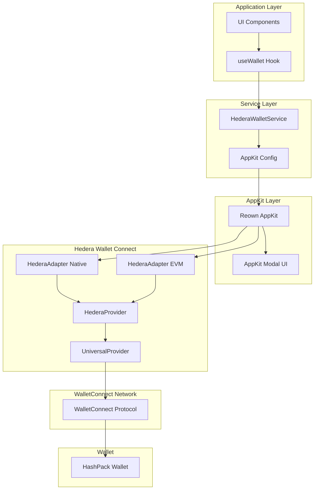
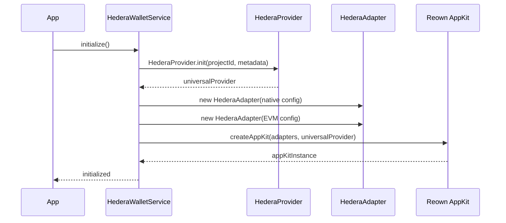
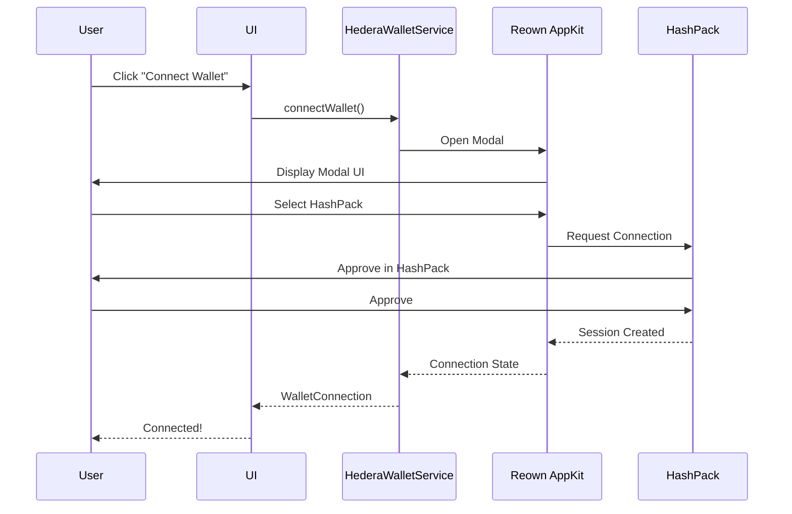

# Design Document - AppKit with HederaProvider Integration

## Overview

Ce document décrit l'architecture et la conception détaillée pour l'intégration de Reown AppKit avec HederaProvider et HederaAdapter. Cette approche combine la modal UI moderne d'AppKit avec l'architecture robuste de HederaProvider, offrant une solution complète et professionnelle pour la connexion wallet.

### Motivation

- **UI Moderne**: Utiliser la modal AppKit pré-construite et maintenue par Reown
- **Architecture Robuste**: Bénéficier de HederaProvider pour la gestion WalletConnect
- **Support Multi-Namespace**: Supporter à la fois Hedera native et EVM via les adapters
- **Maintenance Réduite**: Moins de code custom à maintenir pour l'UI
- **Expérience Utilisateur**: Interface cohérente avec d'autres dApps utilisant AppKit

### Différences avec DAppConnector

| Aspect | DAppConnector (Actuel) | HederaProvider + AppKit (Nouveau) |
|--------|------------------------|-----------------------------------|
| UI Modal | WalletConnectModal (basique) | AppKit Modal (moderne, riche) |
| Architecture | DAppConnector direct | HederaProvider + HederaAdapter |
| Namespace Support | Hedera uniquement | Hedera + EVM via adapters |
| Maintenance UI | Custom code | Maintenu par Reown |
| Complexité | Plus simple, moins de features | Plus complet, plus de features |

## Architecture

### Vue d'ensemble



### Flux d'initialisation



### Flux de connexion



## Components and Interfaces

### 1. HederaProvider Initialization

```typescript
import type UniversalProvider from '@walletconnect/universal-provider';
import { HederaProvider } from '@hashgraph/hedera-wallet-connect';

const metadata = {
  name: 'MazaoChain MVP',
  description: 'Decentralized lending platform for farmers',
  url: 'https://example.com',
  icons: ['https://example.com/favicon.ico']
};

const universalProvider = (await HederaProvider.init({
  projectId: env.NEXT_PUBLIC_WALLETCONNECT_PROJECT_ID,
  metadata,
})) as unknown as UniversalProvider;
```

**Notes importantes:**
- Le cast `as unknown as UniversalProvider` est nécessaire pour la compatibilité TypeScript avec AppKit
- HederaProvider retourne une instance qui implémente UniversalProvider mais avec des propriétés privées supplémentaires
- Cette approche évite les erreurs de type tout en maintenant la fonctionnalité

### 2. HederaAdapter Configuration

#### Native Adapter (Hedera Namespace)

```typescript
import { 
  HederaAdapter, 
  HederaChainDefinition, 
  hederaNamespace 
} from '@hashgraph/hedera-wallet-connect';

const hederaNativeAdapter = new HederaAdapter({
  projectId: env.NEXT_PUBLIC_WALLETCONNECT_PROJECT_ID,
  networks: [
    HederaChainDefinition.Native.Mainnet,
    HederaChainDefinition.Native.Testnet
  ],
  namespace: hederaNamespace, // 'hedera' as CaipNamespace
});
```

**Utilisé pour:**
- Transactions natives Hedera (HTS, HBAR transfers)
- Gestion de tokens Hedera
- Smart contracts Hedera natifs

#### EVM Adapter (EIP-155 Namespace)

```typescript
const hederaEVMAdapter = new HederaAdapter({
  projectId: env.NEXT_PUBLIC_WALLETCONNECT_PROJECT_ID,
  networks: [
    HederaChainDefinition.EVM.Mainnet,  // Chain ID 295
    HederaChainDefinition.EVM.Testnet,  // Chain ID 296
  ],
  namespace: 'eip155',
});
```

**Utilisé pour:**
- Smart contracts EVM sur Hedera
- Transactions Ethereum-like
- Intégration avec outils EVM existants

### 3. AppKit Configuration

```typescript
import { createAppKit } from '@reown/appkit';

const appKitInstance = createAppKit({
  // Adapters pour les deux namespaces
  adapters: [hederaEVMAdapter, hederaNativeAdapter],
  
  // Provider universel de HederaProvider
  //@ts-expect-error expected type error due to private properties
  universalProvider,
  
  // Configuration WalletConnect
  projectId: env.NEXT_PUBLIC_WALLETCONNECT_PROJECT_ID,
  
  // Métadonnées de l'application
  metadata: {
    name: "MazaoChain MVP",
    description: "Decentralized lending platform for farmers",
    url: "http://localhost:3000",
    icons: ["http://localhost:3000/favicon.ico"],
  },
  
  // Réseaux supportés
  networks: [
    // EVM Networks
    HederaChainDefinition.EVM.Mainnet,
    HederaChainDefinition.EVM.Testnet,
    // Native Networks
    HederaChainDefinition.Native.Mainnet,
    HederaChainDefinition.Native.Testnet,
  ],
  
  // Features
  features: {
    analytics: false,  // Désactiver analytics
    email: false,      // Pas de login email
    socials: [],       // Pas de login social
  },
  
  // Thème
  themeMode: "light",
  themeVariables: {
    "--w3m-accent": "#10b981",           // Vert MazaoChain
    "--w3m-background": "#ffffff",
    "--w3m-foreground": "#000000",
    "--w3m-border-radius-master": "8px",
  },
});
```

**Notes sur @ts-expect-error:**
- Nécessaire car UniversalProvider de HederaProvider a des propriétés privées supplémentaires
- L'erreur TypeScript est attendue et ne cause pas de problème à l'exécution
- Alternative: créer un type custom qui étend UniversalProvider

### 4. HederaWalletService (Nouvelle Implémentation)

```typescript
class HederaWalletService {
  private hederaProvider: HederaProvider | null = null;
  private nativeAdapter: HederaAdapter | null = null;
  private evmAdapter: HederaAdapter | null = null;
  private appKitInstance: any = null;
  private connectionState: WalletConnection | null = null;
  private isInitialized = false;
  private client: Client;

  constructor() {
    this.client =
      env.NEXT_PUBLIC_HEDERA_NETWORK === "mainnet"
        ? Client.forMainnet()
        : Client.forTestnet();
    
    suppressWalletConnectErrors();
  }

  async initialize(): Promise<void> {
    if (this.isInitialized) return;

    try {
      // 1. Valider projectId
      if (!env.NEXT_PUBLIC_WALLETCONNECT_PROJECT_ID) {
        throw new WalletError(
          WalletErrorCode.INVALID_PROJECT_ID,
          "WalletConnect Project ID is not configured"
        );
      }

      // 2. Préparer metadata
      const metadata = {
        name: env.NEXT_PUBLIC_HASHPACK_APP_NAME || "MazaoChain MVP",
        description: env.NEXT_PUBLIC_HASHPACK_APP_DESCRIPTION || "...",
        url: env.NEXT_PUBLIC_APP_URL || "http://localhost:3000",
        icons: [`${env.NEXT_PUBLIC_APP_URL}/favicon.ico`],
      };

      // 3. Initialiser HederaProvider
      this.hederaProvider = (await HederaProvider.init({
        projectId: env.NEXT_PUBLIC_WALLETCONNECT_PROJECT_ID,
        metadata,
      })) as unknown as UniversalProvider;

      // 4. Créer Native Adapter
      this.nativeAdapter = new HederaAdapter({
        projectId: env.NEXT_PUBLIC_WALLETCONNECT_PROJECT_ID,
        networks: [
          HederaChainDefinition.Native.Mainnet,
          HederaChainDefinition.Native.Testnet,
        ],
        namespace: hederaNamespace,
      });

      // 5. Créer EVM Adapter
      this.evmAdapter = new HederaAdapter({
        projectId: env.NEXT_PUBLIC_WALLETCONNECT_PROJECT_ID,
        networks: [
          HederaChainDefinition.EVM.Mainnet,
          HederaChainDefinition.EVM.Testnet,
        ],
        namespace: 'eip155',
      });

      // 6. Initialiser AppKit
      this.appKitInstance = createAppKit({
        adapters: [this.evmAdapter, this.nativeAdapter],
        //@ts-expect-error expected type error
        universalProvider: this.hederaProvider,
        projectId: env.NEXT_PUBLIC_WALLETCONNECT_PROJECT_ID,
        metadata,
        networks: [
          HederaChainDefinition.EVM.Mainnet,
          HederaChainDefinition.EVM.Testnet,
          HederaChainDefinition.Native.Mainnet,
          HederaChainDefinition.Native.Testnet,
        ],
        features: {
          analytics: false,
          email: false,
          socials: [],
        },
        themeMode: "light",
        themeVariables: {
          "--w3m-accent": "#10b981",
        },
      });

      // 7. Setup event listeners
      this.setupEventListeners();

      // 8. Restore session if exists
      await this.restoreSession();

      this.isInitialized = true;
    } catch (error) {
      throw new WalletError(
        WalletErrorCode.INITIALIZATION_FAILED,
        "Failed to initialize wallet service",
        error
      );
    }
  }

  private setupEventListeners(): void {
    // AppKit gère les événements automatiquement
    // On peut écouter les changements via les hooks AppKit si nécessaire
  }

  async connectWallet(
    namespace: "hedera" | "eip155" = "hedera"
  ): Promise<WalletConnection> {
    if (!this.isInitialized) {
      await this.initialize();
    }

    if (!this.appKitInstance) {
      throw new WalletError(
        WalletErrorCode.NOT_CONNECTED,
        "AppKit not initialized"
      );
    }

    try {
      // Vérifier si déjà connecté
      if (this.connectionState?.isConnected) {
        return this.connectionState;
      }

      // Ouvrir la modal AppKit
      await this.appKitInstance.open();

      // Attendre la connexion (AppKit gère cela)
      // La connexion sera établie via les événements AppKit

      // Récupérer l'état de connexion depuis AppKit
      const account = await this.getAccountFromAppKit();
      
      if (account) {
        this.connectionState = {
          accountId: account,
          network: env.NEXT_PUBLIC_HEDERA_NETWORK === "mainnet" 
            ? "mainnet" 
            : "testnet",
          isConnected: true,
          namespace,
          chainId: `${namespace}:${env.NEXT_PUBLIC_HEDERA_NETWORK}`,
        };

        return this.connectionState;
      }

      throw new WalletError(
        WalletErrorCode.CONNECTION_REJECTED,
        "No account connected"
      );
    } catch (error) {
      if (error instanceof WalletError) {
        throw error;
      }
      throw new WalletError(
        WalletErrorCode.UNKNOWN_ERROR,
        "Failed to connect wallet",
        error
      );
    }
  }

  private async getAccountFromAppKit(): Promise<string | null> {
    // Récupérer le compte depuis AppKit
    // Implémentation dépend de l'API AppKit
    return null;
  }

  async signTransaction(transaction: Transaction): Promise<Transaction> {
    if (!this.connectionState) {
      throw new WalletError(
        WalletErrorCode.NOT_CONNECTED,
        "Wallet not connected"
      );
    }

    try {
      const adapter = this.connectionState.namespace === "hedera"
        ? this.nativeAdapter
        : this.evmAdapter;

      if (!adapter) {
        throw new WalletError(
          WalletErrorCode.NOT_CONNECTED,
          "Adapter not available"
        );
      }

      // Utiliser l'adapter pour signer
      // L'implémentation exacte dépend de l'API HederaAdapter
      const signedTx = await adapter.signTransaction(transaction);
      
      return signedTx;
    } catch (error) {
      if (error instanceof WalletError) {
        throw error;
      }
      throw new WalletError(
        WalletErrorCode.TRANSACTION_FAILED,
        "Failed to sign transaction",
        error
      );
    }
  }

  async disconnectWallet(): Promise<void> {
    try {
      if (this.appKitInstance) {
        await this.appKitInstance.disconnect();
      }

      this.connectionState = null;
      this.clearSavedSession();
    } catch (error) {
      throw new WalletError(
        WalletErrorCode.UNKNOWN_ERROR,
        "Failed to disconnect",
        error
      );
    }
  }

  // Autres méthodes...
  getConnectionState(): WalletConnection | null {
    return this.connectionState;
  }

  isConnected(): boolean {
    return this.connectionState?.isConnected ?? false;
  }

  getAccountId(): string | null {
    return this.connectionState?.accountId ?? null;
  }

  getActiveNamespace(): "hedera" | "eip155" | null {
    return this.connectionState?.namespace ?? null;
  }
}
```

### 5. AppKit Configuration File (appkit-config.ts)

```typescript
"use client";

import { createAppKit } from '@reown/appkit';
import type UniversalProvider from '@walletconnect/universal-provider';
import { HederaAdapter, HederaChainDefinition, hederaNamespace } from '@hashgraph/hedera-wallet-connect';
import { env } from '@/lib/config/env';

export interface AppKitConfig {
  adapters: HederaAdapter[];
  universalProvider: UniversalProvider;
}

export function initializeAppKit(config: AppKitConfig) {
  const { adapters, universalProvider } = config;

  const metadata = {
    name: env.NEXT_PUBLIC_HASHPACK_APP_NAME || "MazaoChain MVP",
    description: env.NEXT_PUBLIC_HASHPACK_APP_DESCRIPTION || "Decentralized lending platform",
    url: env.NEXT_PUBLIC_APP_URL || "http://localhost:3000",
    icons: [`${env.NEXT_PUBLIC_APP_URL}/favicon.ico`],
  };

  return createAppKit({
    adapters,
    //@ts-expect-error expected type error due to private properties
    universalProvider,
    projectId: env.NEXT_PUBLIC_WALLETCONNECT_PROJECT_ID!,
    metadata,
    networks: [
      HederaChainDefinition.EVM.Mainnet,
      HederaChainDefinition.EVM.Testnet,
      HederaChainDefinition.Native.Mainnet,
      HederaChainDefinition.Native.Testnet,
    ],
    features: {
      analytics: false,
      email: false,
      socials: [],
    },
    themeMode: "light",
    themeVariables: {
      "--w3m-accent": "#10b981",           // MazaoChain green
      "--w3m-background": "#ffffff",
      "--w3m-foreground": "#000000",
      "--w3m-border-radius-master": "8px",
    },
  });
}
```

## Data Models

### WalletConnection (Inchangé)

```typescript
interface WalletConnection {
  accountId: string;
  network: 'mainnet' | 'testnet';
  isConnected: boolean;
  namespace: 'hedera' | 'eip155';
  chainId: string;
}
```

### AppKit State

AppKit gère son propre état en interne:
- Sessions actives
- Comptes connectés
- Réseau sélectionné
- État de la modal

Notre service synchronise cet état avec `WalletConnection`.

## Error Handling

### Codes d'erreur (Inchangés)

```typescript
enum WalletErrorCode {
  INITIALIZATION_FAILED = 'INITIALIZATION_FAILED',
  NOT_CONNECTED = 'NOT_CONNECTED',
  CONNECTION_REJECTED = 'CONNECTION_REJECTED',
  CONNECTION_TIMEOUT = 'CONNECTION_TIMEOUT',
  TRANSACTION_REJECTED = 'TRANSACTION_REJECTED',
  TRANSACTION_FAILED = 'TRANSACTION_FAILED',
  INSUFFICIENT_BALANCE = 'INSUFFICIENT_BALANCE',
  INVALID_TRANSACTION = 'INVALID_TRANSACTION',
  NETWORK_ERROR = 'NETWORK_ERROR',
  WALLET_NOT_INSTALLED = 'WALLET_NOT_INSTALLED',
  INVALID_PROJECT_ID = 'INVALID_PROJECT_ID',
  UNKNOWN_ERROR = 'UNKNOWN_ERROR'
}
```

### Gestion des erreurs spécifiques

```typescript
// Erreur HederaProvider.init
try {
  await HederaProvider.init({...});
} catch (error) {
  throw new WalletError(
    WalletErrorCode.INITIALIZATION_FAILED,
    "Failed to initialize HederaProvider",
    error
  );
}

// Erreur AppKit connection
try {
  await appKitInstance.open();
} catch (error) {
  if (error.message.includes("rejected")) {
    throw new WalletError(
      WalletErrorCode.CONNECTION_REJECTED,
      "User rejected connection"
    );
  }
  throw new WalletError(
    WalletErrorCode.UNKNOWN_ERROR,
    "Failed to open AppKit modal",
    error
  );
}
```

## Testing Strategy

### Mocks nécessaires

```typescript
// Mock HederaProvider
jest.mock('@hashgraph/hedera-wallet-connect', () => ({
  HederaProvider: {
    init: jest.fn().mockResolvedValue({
      // Mock UniversalProvider
      request: jest.fn(),
      on: jest.fn(),
      off: jest.fn(),
    }),
  },
  HederaAdapter: jest.fn().mockImplementation((config) => ({
    namespace: config.namespace,
    networks: config.networks,
    signTransaction: jest.fn(),
  })),
  HederaChainDefinition: {
    Native: {
      Mainnet: { chainId: 'hedera:mainnet' },
      Testnet: { chainId: 'hedera:testnet' },
    },
    EVM: {
      Mainnet: { chainId: 'eip155:295' },
      Testnet: { chainId: 'eip155:296' },
    },
  },
  hederaNamespace: 'hedera',
}));

// Mock AppKit
jest.mock('@reown/appkit', () => ({
  createAppKit: jest.fn().mockReturnValue({
    open: jest.fn(),
    disconnect: jest.fn(),
    getAccount: jest.fn(),
  }),
}));
```

### Tests à implémenter

1. **Initialization Tests**
   - HederaProvider.init appelé avec les bons paramètres
   - Adapters créés avec les bons namespaces
   - AppKit initialisé avec adapters et provider

2. **Connection Tests**
   - Modal AppKit s'ouvre
   - État de connexion mis à jour après connexion
   - Erreurs gérées correctement

3. **Transaction Tests**
   - Bon adapter sélectionné selon namespace
   - Transactions signées correctement
   - Erreurs de signature gérées

4. **Disconnection Tests**
   - AppKit disconnect appelé
   - État nettoyé
   - Sessions supprimées

## Migration Path

### Phase 1: Préparation

1. Vérifier que les packages sont installés:
   ```bash
   npm list @hashgraph/hedera-wallet-connect
   npm list @reown/appkit
   npm list @walletconnect/universal-provider
   ```

2. Créer une branche de migration:
   ```bash
   git checkout -b feature/appkit-hedera-provider
   ```

### Phase 2: Implémentation

1. Créer `src/lib/wallet/appkit-config.ts`
2. Mettre à jour `src/lib/wallet/hedera-wallet.ts`
3. Tester l'initialisation
4. Tester la connexion
5. Tester les transactions

### Phase 3: Tests

1. Mettre à jour les mocks
2. Mettre à jour les tests existants
3. Ajouter nouveaux tests pour AppKit
4. Vérifier la couverture

### Phase 4: Documentation

1. Mettre à jour README
2. Créer guide de migration
3. Documenter les différences avec DAppConnector

## Performance Considerations

### Avantages

- **Bundle Size**: AppKit est déjà installé, pas de surcoût
- **Lazy Loading**: AppKit peut être chargé à la demande
- **Caching**: AppKit gère le cache des sessions

### Inconvénients

- **Initial Load**: AppKit ajoute du poids initial
- **Complexity**: Plus de couches d'abstraction

### Optimisations

```typescript
// Lazy load AppKit
const loadAppKit = async () => {
  const { createAppKit } = await import('@reown/appkit');
  return createAppKit({...});
};
```

## Security Considerations

### Identiques à DAppConnector

- Pas de clés privées stockées
- Sessions chiffrées par WalletConnect
- Validation des signatures
- Expiration des sessions

### Spécifiques à AppKit

- AppKit gère la sécurité de la modal
- Validation des wallets supportés
- Protection contre le phishing via metadata

## Rollback Strategy

Si des problèmes surviennent:

1. **Rollback immédiat**: Revenir à DAppConnector
   ```bash
   git revert <commit-hash>
   ```

2. **Garder les deux**: Implémenter un feature flag
   ```typescript
   const useAppKit = env.NEXT_PUBLIC_USE_APPKIT === 'true';
   ```

3. **Migration progressive**: Tester avec un % d'utilisateurs

## Conclusion

L'intégration HederaProvider + AppKit offre:

✅ UI moderne et professionnelle
✅ Support multi-namespace (Hedera + EVM)
✅ Maintenance réduite de l'UI
✅ Architecture robuste et éprouvée
✅ Compatibilité avec l'écosystème WalletConnect

Cette approche est recommandée pour les applications nécessitant une UI wallet moderne et un support complet des namespaces Hedera.
