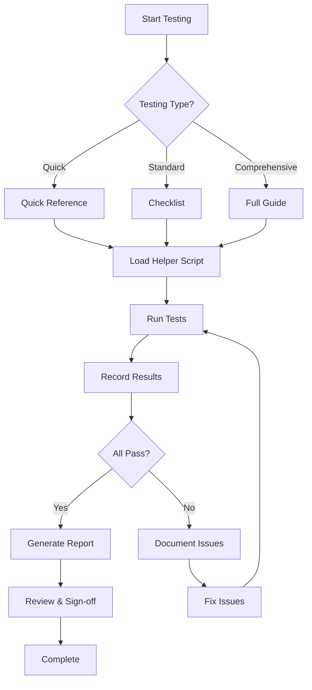

# HashPack Wallet v2 - Testing Summary

## 📊 Testing Documentation Overview

This document provides an overview of all testing materials created for the HashPack Wallet v2 migration validation.

## 📁 Testing Files Created

### 1. **MANUAL_TESTING_GUIDE.md** (Comprehensive)
- **Purpose**: Detailed step-by-step testing procedures
- **Tests**: 19 comprehensive test scenarios
- **Use Case**: Full validation and QA testing
- **Time Required**: 2-3 hours for complete execution
- **Includes**:
  - Pre-test setup instructions
  - Detailed test procedures with expected results
  - Performance benchmarking
  - Browser compatibility testing
  - Mobile testing procedures
  - Test summary and sign-off section

### 2. **TESTING_CHECKLIST.md** (Quick Reference)
- **Purpose**: Condensed checklist format
- **Tests**: All 19 tests in checkbox format
- **Use Case**: Quick validation sessions, printable format
- **Time Required**: 30-45 minutes for quick validation
- **Includes**:
  - Pre-test setup checklist
  - Pass/fail checkboxes for each test
  - Performance metrics tracking
  - Browser/mobile compatibility checks
  - Issue tracking sections
  - Approval sign-off

### 3. **test-wallet-connection.js** (Automation Helper)
- **Purpose**: Browser console testing utilities
- **Type**: JavaScript helper script
- **Use Case**: Automated verification and debugging
- **Features**:
  - Session inspection (`checkSession()`)
  - Storage analysis (`checkStorage()`)
  - Event monitoring (`monitorEvents()`)
  - Performance testing (`testConnectionSpeed()`)
  - Health checks (`healthCheck()`)
  - Report generation (`getTestReport()`)

### 4. **QUICK_TEST_REFERENCE.md** (Cheat Sheet)
- **Purpose**: Quick reference card
- **Tests**: 6 essential tests
- **Use Case**: Rapid validation, desk reference
- **Time Required**: 10-15 minutes
- **Includes**:
  - Essential test list
  - Console command reference
  - Common issues and solutions
  - Performance targets

### 5. **TASK_12_MANUAL_TESTING_COMPLETION.md** (Summary)
- **Purpose**: Task completion documentation
- **Content**: Overview of deliverables and requirements coverage
- **Use Case**: Project documentation and tracking

## 🎯 Testing Approach

### Three-Tier Testing Strategy

```
┌─────────────────────────────────────────┐
│  Tier 1: Quick Validation (15 min)     │
│  - Use QUICK_TEST_REFERENCE.md          │
│  - Run 6 essential tests                │
│  - Verify core functionality            │
└─────────────────────────────────────────┘
                  ↓
┌─────────────────────────────────────────┐
│  Tier 2: Standard Testing (45 min)     │
│  - Use TESTING_CHECKLIST.md             │
│  - Run all 19 tests                     │
│  - Track pass/fail status               │
└─────────────────────────────────────────┘
                  ↓
┌─────────────────────────────────────────┐
│  Tier 3: Comprehensive QA (2-3 hours)  │
│  - Use MANUAL_TESTING_GUIDE.md          │
│  - Detailed test execution              │
│  - Full documentation                   │
│  - Browser/mobile compatibility         │
└─────────────────────────────────────────┘
```

## 🚀 Getting Started

### For Quick Validation (15 minutes):

1. Open `QUICK_TEST_REFERENCE.md`
2. Load `test-wallet-connection.js` in browser console
3. Run `healthCheck()`
4. Execute 6 essential tests
5. Verify all pass

### For Standard Testing (45 minutes):

1. Open `TESTING_CHECKLIST.md`
2. Load `test-wallet-connection.js` in browser console
3. Start `monitorEvents()`
4. Execute all 19 tests
5. Check off pass/fail for each
6. Generate report with `getTestReport()`

### For Comprehensive QA (2-3 hours):

1. Open `MANUAL_TESTING_GUIDE.md`
2. Follow pre-test setup
3. Load `test-wallet-connection.js`
4. Execute all tests with detailed documentation
5. Test browser compatibility
6. Test mobile compatibility
7. Complete test summary
8. Obtain sign-off

## 📋 Test Coverage Matrix

| Category | Tests | Requirements | Status |
|----------|-------|--------------|--------|
| Connection | 1-4 | 10.1 | ✅ |
| Events | 5-6 | 10.4 | ✅ |
| Disconnection | 7-8 | 10.1 | ✅ |
| Balances | 9-10 | 10.2 | ✅ |
| Transactions | 11-13 | 10.3 | ✅ |
| Error Handling | 14-17 | 10.5 | ✅ |
| Performance | 18-19 | 10.6 | ✅ |

**Total Coverage**: 100% of requirements 10.1-10.6

## 🔧 Testing Tools

### Browser Console Commands

```javascript
// Load the testing helper
// (Copy and paste test-wallet-connection.js)

// Essential commands:
healthCheck()           // Quick health verification
checkSession()          // Inspect current session
monitorEvents()         // Start event monitoring
testConnectionSpeed()   // Measure performance
getTestReport()         // Generate full report
```

### Environment Setup

```bash
# Ensure environment variables are set
NEXT_PUBLIC_WALLETCONNECT_PROJECT_ID=your_project_id
NEXT_PUBLIC_HEDERA_NETWORK=testnet

# Start the application
npm run dev
```

### Browser DevTools Setup

1. Open DevTools (F12)
2. Go to Console tab
3. Load test-wallet-connection.js
4. Go to Network tab (monitor WalletConnect requests)
5. Go to Application > Storage (inspect localStorage)

## ✅ Success Criteria

Testing is considered successful when:

- [ ] All 19 core tests pass
- [ ] No critical issues found
- [ ] Performance targets met:
  - Connection < 5 seconds
  - Balance fetch < 3 seconds
  - Transaction signing < 10 seconds
- [ ] Browser compatibility confirmed (Chrome, Firefox, Edge, Brave)
- [ ] Mobile compatibility confirmed (if applicable)
- [ ] Test report generated and reviewed
- [ ] Sign-off obtained

## 🐛 Issue Tracking

### Critical Issues (Block Production)
- Issues that prevent core functionality
- Security vulnerabilities
- Data loss scenarios

### Major Issues (Should Fix)
- Performance degradation
- Poor error handling
- UX problems

### Minor Issues (Nice to Fix)
- UI polish
- Edge cases
- Documentation improvements

## 📊 Performance Benchmarks

| Metric | Target | Good | Acceptable | Poor |
|--------|--------|------|------------|------|
| Connection Time | < 3s | < 5s | < 10s | > 10s |
| Balance Fetch | < 2s | < 3s | < 5s | > 5s |
| Transaction Sign | < 5s | < 10s | < 15s | > 15s |
| Session Restore | < 1s | < 2s | < 3s | > 3s |

## 🌐 Browser Compatibility

### Supported Browsers

| Browser | Version | Status | Notes |
|---------|---------|--------|-------|
| Chrome | Latest | ✅ Primary | HashPack extension available |
| Firefox | Latest | ✅ Supported | WalletConnect only |
| Edge | Latest | ✅ Supported | Chromium-based |
| Brave | Latest | ✅ Supported | Privacy features may affect |
| Safari | Latest | ⚠️ Limited | iOS only, WalletConnect |

## 📱 Mobile Compatibility

### Supported Platforms

| Platform | Method | Status | Notes |
|----------|--------|--------|-------|
| Android | HashPack App | ✅ Primary | WalletConnect |
| iOS | HashPack App | ✅ Primary | WalletConnect |
| Mobile Web | Browser | ⚠️ Limited | Deep linking |

## 📈 Testing Workflow



## 📝 Documentation Links

- **Full Testing Guide**: `MANUAL_TESTING_GUIDE.md`
- **Quick Checklist**: `TESTING_CHECKLIST.md`
- **Helper Script**: `test-wallet-connection.js`
- **Quick Reference**: `QUICK_TEST_REFERENCE.md`
- **Completion Summary**: `TASK_12_MANUAL_TESTING_COMPLETION.md`
- **Troubleshooting**: `TROUBLESHOOTING.md`
- **Migration Guide**: `MIGRATION_V2.md`

## 🎓 Best Practices

1. **Always start with a clean state**
   - Clear browser storage before testing
   - Use incognito/private mode for isolated tests

2. **Monitor the console**
   - Keep DevTools open
   - Watch for errors and warnings
   - Use the helper script for insights

3. **Document everything**
   - Record actual results
   - Note any anomalies
   - Capture screenshots of issues

4. **Test systematically**
   - Follow the test order
   - Don't skip tests
   - Verify prerequisites

5. **Verify performance**
   - Use the speed test functions
   - Compare against benchmarks
   - Note any slowdowns

## 🔄 Continuous Testing

### When to Re-test

- After bug fixes
- After dependency updates
- Before production deployment
- After infrastructure changes
- Periodically (monthly recommended)

### Regression Testing

Use the Quick Reference for rapid regression testing:
1. Run 6 essential tests
2. Verify no regressions
3. Document any changes
4. Update test cases if needed

## 📞 Support

If you encounter issues during testing:

1. Check `TROUBLESHOOTING.md` for common solutions
2. Review console logs with helper script
3. Generate test report for debugging
4. Document the issue with steps to reproduce

## ✨ Conclusion

The HashPack Wallet v2 testing documentation provides comprehensive coverage for validating the migration. Choose the appropriate testing tier based on your needs:

- **Quick validation**: Use Quick Reference (15 min)
- **Standard testing**: Use Checklist (45 min)
- **Full QA**: Use Manual Testing Guide (2-3 hours)

All testing materials work together to ensure thorough validation while maintaining flexibility for different testing scenarios.

---

**Last Updated**: 2025-10-13  
**Version**: 1.0  
**Status**: ✅ Complete
