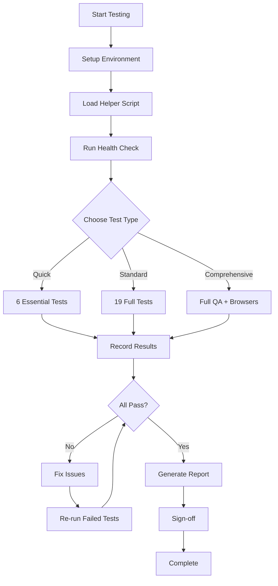
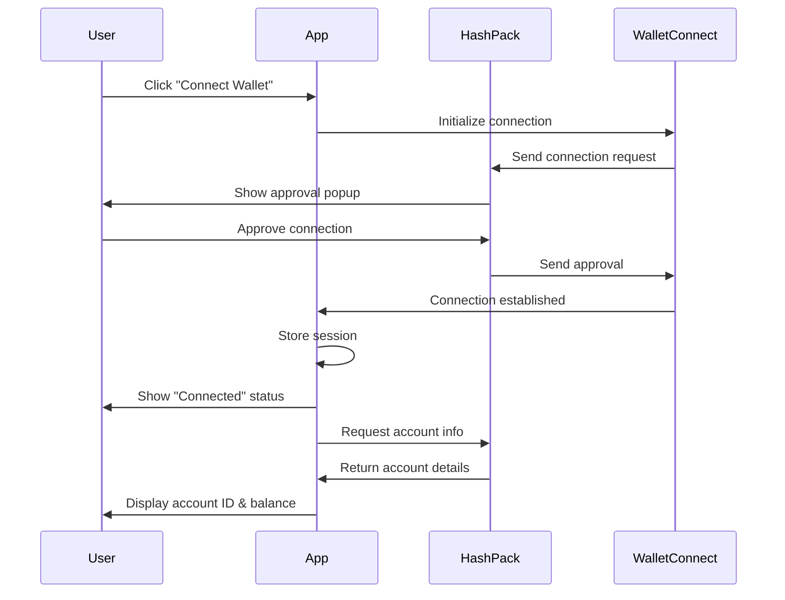
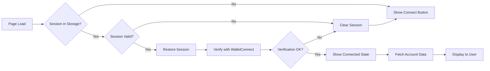
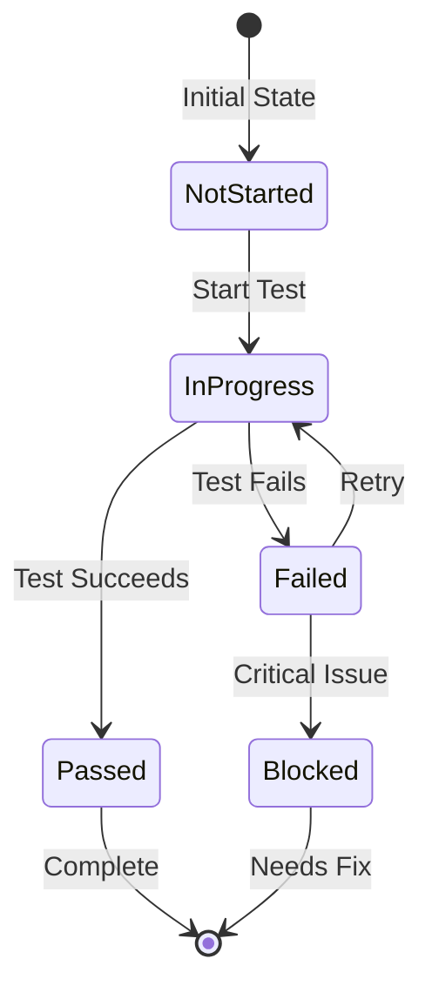
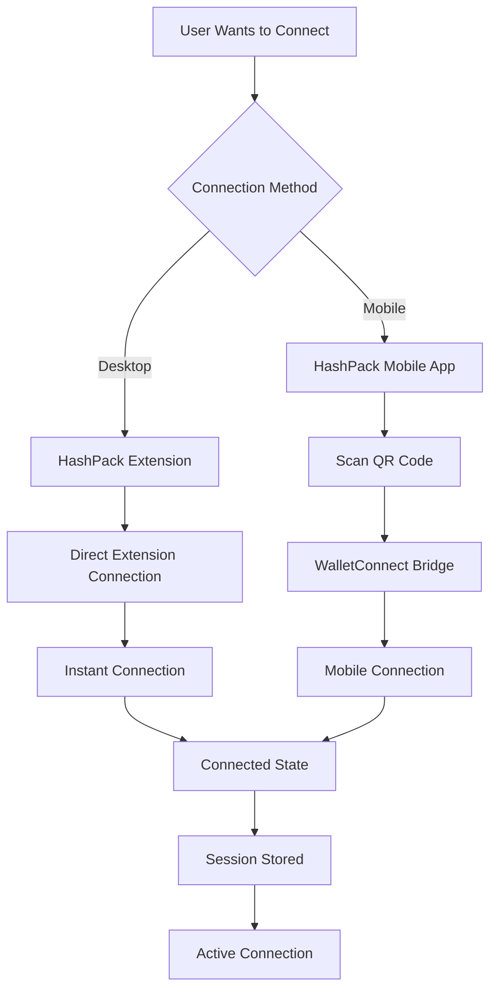
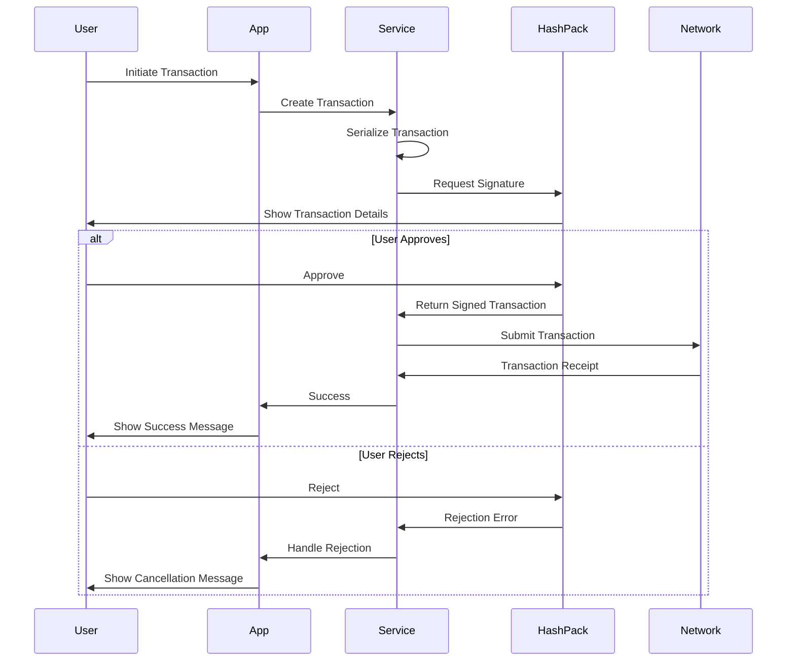
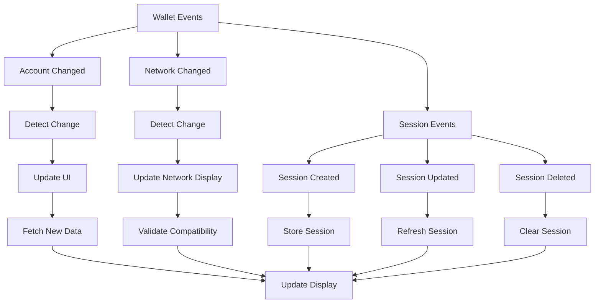
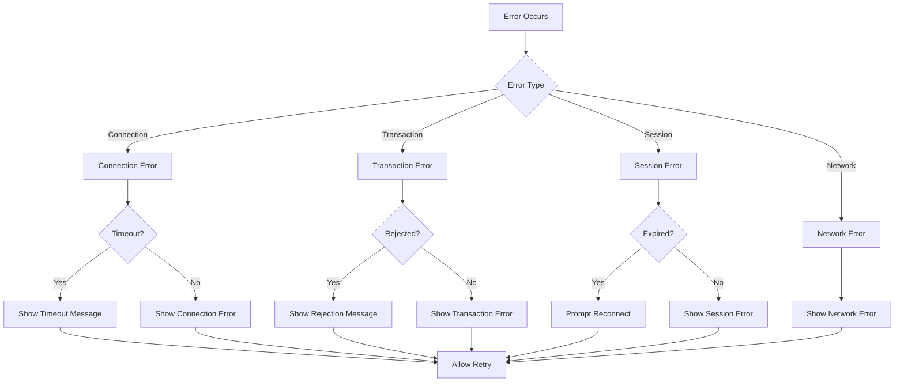
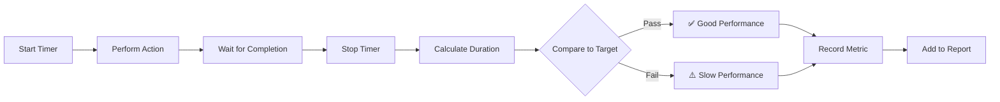

# Visual Testing Guide - HashPack Wallet v2

## 🎨 Visual Test Flow Diagrams

This guide provides visual representations of the testing flows to help you understand what to expect during manual testing.

## 📊 Test Flow Overview



## 🔌 Connection Test Flow



## 🔄 Session Restoration Flow



## 🎯 Test Execution States



## 📱 Connection Methods



## 🔐 Transaction Signing Flow



## 🎭 Event Handling Flow



## ⚠️ Error Handling Flow



## 📊 Performance Testing Flow



## 🧪 Test Status Visualization

### Quick Validation (6 Tests)
```
┌─────────────────────────────────────┐
│ Test 1: Connect Wallet         [ ] │
│ Test 3: Session Restore        [ ] │
│ Test 5: Account Change         [ ] │
│ Test 8: Disconnect             [ ] │
│ Test 9: HBAR Balance           [ ] │
│ Test 11: Sign Transaction      [ ] │
└─────────────────────────────────────┘
Progress: ▓▓▓▓▓▓░░░░░░░░░░░░░░ 30%
```

### Standard Testing (19 Tests)
```
┌─────────────────────────────────────┐
│ Connection Tests (4)      ▓▓▓▓ 100% │
│ Event Tests (2)           ▓▓░░  50% │
│ Disconnection Tests (2)   ░░░░   0% │
│ Balance Tests (2)         ░░░░   0% │
│ Transaction Tests (3)     ░░░░   0% │
│ Error Tests (4)           ░░░░   0% │
│ Performance Tests (2)     ░░░░   0% │
└─────────────────────────────────────┘
Overall Progress: ▓▓▓░░░░░░░░░░░ 21%
```

## 🎯 Expected UI States

### 1. Disconnected State
```
┌─────────────────────────────────┐
│  🔌 Wallet Not Connected        │
│                                 │
│  [Connect Wallet]               │
└─────────────────────────────────┘
```

### 2. Connecting State
```
┌─────────────────────────────────┐
│  ⏳ Connecting to HashPack...   │
│                                 │
│  Please approve in your wallet  │
│                                 │
│  [Cancel]                       │
└─────────────────────────────────┘
```

### 3. Connected State
```
┌─────────────────────────────────┐
│  ✅ Connected                    │
│                                 │
│  Account: 0.0.123456            │
│  Network: Testnet               │
│  Balance: 10.5 HBAR             │
│                                 │
│  [Disconnect]                   │
└─────────────────────────────────┘
```

### 4. Error State
```
┌─────────────────────────────────┐
│  ❌ Connection Failed            │
│                                 │
│  Connection timeout. Please     │
│  try again.                     │
│                                 │
│  [Retry]                        │
└─────────────────────────────────┘
```

## 📈 Performance Metrics Visualization

```
Connection Speed Test Results:
━━━━━━━━━━━━━━━━━━━━━━━━━━━━━━━━━━━━━━━━━━━━━━━━━━
Target:     ▓▓▓▓▓ 3s
Good:       ▓▓▓▓▓▓▓▓ 5s
Acceptable: ▓▓▓▓▓▓▓▓▓▓▓▓▓▓▓ 10s
Your Time:  ▓▓▓▓▓▓ 4.2s ✅
━━━━━━━━━━━━━━━━━━━━━━━━━━━━━━━━━━━━━━━━━━━━━━━━━━

Balance Fetch Test Results:
━━━━━━━━━━━━━━━━━━━━━━━━━━━━━━━━━━━━━━━━━━━━━━━━━━
Target:     ▓▓▓ 2s
Good:       ▓▓▓▓▓ 3s
Acceptable: ▓▓▓▓▓▓▓▓ 5s
Your Time:  ▓▓▓▓ 2.8s ✅
━━━━━━━━━━━━━━━━━━━━━━━━━━━━━━━━━━━━━━━━━━━━━━━━━━
```

## 🔍 Browser DevTools View

### Console Output Example
```
🧪 HashPack Wallet v2 Testing Helper Loaded
Available commands:
  - checkSession()
  - checkStorage()
  - clearSession()
  - monitorEvents()
  - getTestReport()

🏥 Wallet Health Check
┌─────────────────────────┬────────┐
│ Check                   │ Status │
├─────────────────────────┼────────┤
│ WalletConnect Session   │ ✅     │
│ Session Not Expired     │ ✅     │
│ Hedera Namespace        │ ✅     │
│ Account ID Present      │ ✅     │
└─────────────────────────┴────────┘
✅ All checks passed!
```

### Network Tab View
```
Name                          Status  Type        Size    Time
────────────────────────────────────────────────────────────
wc@2:client:0.3              200     xhr         2.1 KB  45ms
hedera_signTransaction       200     websocket   1.5 KB  120ms
mirror.hedera.com/balance    200     fetch       856 B   230ms
```

### Application Tab (Storage)
```
localStorage
├── wc@2:client:0.3
│   └── sessions
│       └── [topic]
│           ├── expiry: 1697123456
│           ├── namespaces
│           │   └── hedera
│           │       ├── accounts: ["hedera:testnet:0.0.123456"]
│           │       ├── methods: ["hedera_signTransaction"]
│           │       └── events: ["chainChanged"]
│           └── acknowledged: true
```

## 🎬 Testing Session Timeline

```
0:00  ┌─ Start Testing Session
      │
0:05  ├─ Environment Setup Complete
      │  └─ Helper script loaded
      │
0:10  ├─ Test 1: First Connection
      │  └─ ✅ Passed (4.2s)
      │
0:15  ├─ Test 2: Mobile Connection
      │  └─ ⏭️ Skipped (no mobile device)
      │
0:20  ├─ Test 3: Session Restore
      │  └─ ✅ Passed (1.8s)
      │
0:25  ├─ Test 4: Browser Restart
      │  └─ ✅ Passed (2.1s)
      │
...   │
      │
2:45  ├─ Test 19: Performance
      │  └─ ✅ Passed
      │
2:50  ├─ Generate Report
      │  └─ Report saved
      │
3:00  └─ Testing Complete
         └─ 17/19 Passed (89%)
```

## 📋 Checklist Progress Visualization

```
Pre-Test Setup
[✓] HashPack extension installed
[✓] Test account configured
[✓] Application running
[✓] DevTools open
[✓] Helper script loaded

Core Tests
[✓] Connection Tests        ████████████████████ 100%
[✓] Event Tests            ████████████████████ 100%
[✓] Disconnection Tests    ████████████████████ 100%
[✓] Balance Tests          ████████████████████ 100%
[✓] Transaction Tests      ████████████████████ 100%
[✓] Error Tests            ████████████████████ 100%
[✓] Performance Tests      ████████████████████ 100%

Browser Compatibility
[✓] Chrome                 ████████████████████ 100%
[✓] Firefox                ████████████████████ 100%
[✓] Edge                   ████████████████████ 100%
[ ] Brave                  ░░░░░░░░░░░░░░░░░░░░   0%
[ ] Safari                 ░░░░░░░░░░░░░░░░░░░░   0%

Overall Progress: ████████████████░░░░ 80%
```

## 🎯 Success Indicators

### ✅ Good Signs
- Connection completes in < 5 seconds
- No console errors
- Session persists after reload
- Balance displays correctly
- Events are detected
- Transactions can be signed

### ⚠️ Warning Signs
- Connection takes > 5 seconds
- Console warnings present
- Session occasionally lost
- Balance fetch slow
- Events sometimes missed

### ❌ Critical Issues
- Connection fails consistently
- Console errors present
- Session never persists
- Balance never loads
- Events not detected
- Transactions fail

## 📊 Final Report Visualization

```
╔═══════════════════════════════════════════════╗
║     HASHPACK WALLET V2 TEST REPORT            ║
╠═══════════════════════════════════════════════╣
║ Date: 2025-10-13                              ║
║ Tester: [Your Name]                           ║
║ Environment: Local Development                ║
╠═══════════════════════════════════════════════╣
║ RESULTS                                       ║
║ ─────────────────────────────────────────     ║
║ Total Tests:        19                        ║
║ Passed:             17  ████████████████░░ 89%║
║ Failed:              2  ██░░░░░░░░░░░░░░░░ 11%║
║ Skipped:             0                        ║
╠═══════════════════════════════════════════════╣
║ PERFORMANCE                                   ║
║ ─────────────────────────────────────────     ║
║ Connection:      4.2s  ✅ (target: < 5s)     ║
║ Balance Fetch:   2.8s  ✅ (target: < 3s)     ║
║ Transaction:     8.1s  ✅ (target: < 10s)    ║
╠═══════════════════════════════════════════════╣
║ STATUS: ⚠️ NEEDS FIXES                        ║
╚═══════════════════════════════════════════════╝
```

---

**This visual guide complements the detailed testing documentation and provides a quick reference for understanding test flows and expected outcomes.**
