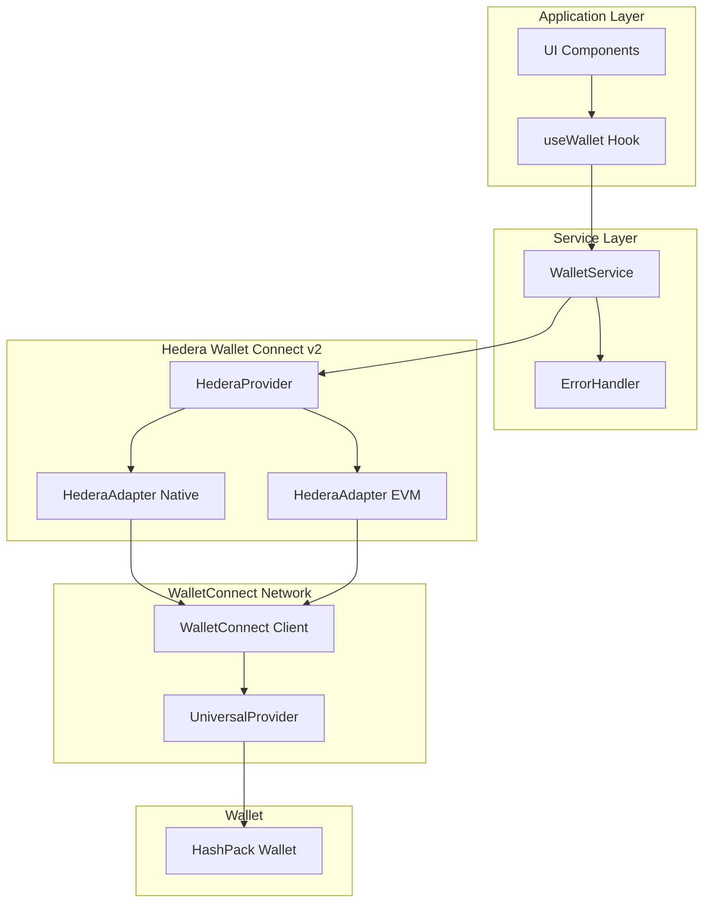

# Design Document - Migration HashPack Wallet vers v2

## Overview

Ce document décrit l'architecture et la conception détaillée pour la migration de l'intégration HashPack Wallet de la version 1.5.1 vers la version 2.x. La migration introduit une architecture modernisée basée sur `HederaProvider` et `HederaAdapter`, avec un support complet pour les namespaces Hedera native et EVM, une meilleure gestion des sessions, et une expérience utilisateur améliorée.

### Objectifs de la migration

1. Résoudre les problèmes de connexion actuels avec HashPack
2. Aligner l'implémentation avec les recommandations officielles Hedera/HashPack
3. Supporter les deux namespaces (Hedera native et EVM)
4. Améliorer la stabilité et la fiabilité des connexions
5. Simplifier la gestion des transactions
6. Offrir une option moderne avec Reown AppKit

## Architecture

### Vue d'ensemble de l'architecture



### Composants principaux


#### 1. HederaWalletService (Refactorisé)

Service principal gérant toutes les interactions avec le wallet HashPack via la v2.

**Responsabilités:**
- Initialisation du `HederaProvider` avec les métadonnées de l'application
- Création et gestion des `HederaAdapter` pour les namespaces native et EVM
- Gestion du cycle de vie des connexions
- Gestion des événements de session
- Signature de transactions et messages
- Récupération des balances

**Changements clés par rapport à v1:**
- Remplacement de `DAppConnector` par `HederaProvider`
- Utilisation de `HederaAdapter` pour chaque namespace
- Suppression de la configuration manuelle des node IDs
- Amélioration de la gestion des sessions avec restauration automatique

#### 2. HederaProvider

Provider central de la bibliothèque v2 qui gère la communication avec WalletConnect.

**Configuration:**
```typescript
{
  projectId: string,
  metadata: {
    name: string,
    description: string,
    url: string,
    icons: string[]
  }
}
```

#### 3. HederaAdapter (Native et EVM)

Adaptateurs spécifiques pour chaque namespace permettant d'interagir avec Hedera.

**HederaAdapter Native:**
- Namespace: `hedera`
- Réseaux: `HederaChainDefinition.Native.Mainnet`, `HederaChainDefinition.Native.Testnet`
- Utilisé pour: Transactions natives Hedera, transferts HBAR, gestion de tokens HTS

**HederaAdapter EVM:**
- Namespace: `eip155`
- Réseaux: `HederaChainDefinition.EVM.Mainnet` (295), `HederaChainDefinition.EVM.Testnet` (296)
- Utilisé pour: Smart contracts EVM, transactions Ethereum-like

## Components and Interfaces

### Interface: WalletConnection

```typescript
interface WalletConnection {
  accountId: string;
  network: 'mainnet' | 'testnet';
  isConnected: boolean;
  namespace: 'hedera' | 'eip155';
  chainId: string;
}
```

### Interface: WalletSession

```typescript
interface WalletSession {
  topic: string;
  expiry: number;
  namespaces: {
    hedera?: {
      accounts: string[];
      methods: string[];
      events: string[];
    };
    eip155?: {
      accounts: string[];
      methods: string[];
      events: string[];
    };
  };
}
```

### Interface: TransactionRequest

```typescript
interface TransactionRequest {
  namespace: 'hedera' | 'eip155';
  method: string;
  params: {
    transactionBytes?: string;
    signerAccountId?: string;
    [key: string]: unknown;
  };
}
```


### Classe: HederaWalletService (v2)

```typescript
class HederaWalletService {
  private hederaProvider: HederaProvider | null;
  private nativeAdapter: HederaAdapter | null;
  private evmAdapter: HederaAdapter | null;
  private connectionState: WalletConnection | null;
  private sessionListeners: Map<string, Function>;
  
  // Initialisation
  async initialize(): Promise<void>
  
  // Connexion
  async connectWallet(namespace?: 'hedera' | 'eip155'): Promise<WalletConnection>
  async disconnectWallet(): Promise<void>
  
  // Gestion des sessions
  private setupSessionListeners(): void
  private handleSessionEvent(event: SessionEvent): void
  private handleSessionUpdate(event: SessionUpdate): void
  private handleSessionDelete(event: SessionDelete): void
  private restoreExistingSession(): Promise<WalletConnection | null>
  
  // Transactions
  async signTransaction(transaction: Transaction, namespace: 'hedera'): Promise<Transaction>
  async signAndExecuteTransaction(transaction: Transaction): Promise<TransactionReceipt>
  async signMessage(message: string): Promise<SignatureMap>
  
  // Balances
  async getAccountBalance(accountId?: string): Promise<WalletBalances>
  
  // État
  getConnectionState(): WalletConnection | null
  isConnected(): boolean
  getAccountId(): string | null
  getActiveNamespace(): 'hedera' | 'eip155' | null
}
```

## Data Models

### Session Storage

Les sessions sont stockées par WalletConnect dans le localStorage avec la structure suivante:

```typescript
{
  "wc@2:client:0.3": {
    "sessions": {
      "[topic]": {
        "topic": "string",
        "relay": { "protocol": "irn" },
        "expiry": number,
        "acknowledged": boolean,
        "controller": "string",
        "namespaces": {
          "hedera": {
            "accounts": ["hedera:testnet:0.0.xxxxx"],
            "methods": ["hedera_signTransaction", "hedera_signMessage"],
            "events": ["chainChanged", "accountsChanged"]
          }
        },
        "requiredNamespaces": {},
        "optionalNamespaces": {},
        "pairingTopic": "string",
        "self": { "publicKey": "string", "metadata": {} },
        "peer": { "publicKey": "string", "metadata": {} }
      }
    }
  }
}
```

### Connection State Management

```typescript
// État de connexion stocké en mémoire
{
  accountId: "0.0.123456",
  network: "testnet",
  isConnected: true,
  namespace: "hedera",
  chainId: "hedera:testnet"
}
```

## Error Handling

### Hiérarchie des erreurs

```typescript
class WalletError extends Error {
  code: WalletErrorCode;
  originalError?: unknown;
}

enum WalletErrorCode {
  // Erreurs de connexion
  CONNECTION_TIMEOUT = 'CONNECTION_TIMEOUT',
  CONNECTION_REJECTED = 'CONNECTION_REJECTED',
  WALLET_NOT_INSTALLED = 'WALLET_NOT_INSTALLED',
  INVALID_PROJECT_ID = 'INVALID_PROJECT_ID',
  NETWORK_ERROR = 'NETWORK_ERROR',
  
  // Erreurs de session
  SESSION_EXPIRED = 'SESSION_EXPIRED',
  SESSION_NOT_FOUND = 'SESSION_NOT_FOUND',
  INVALID_SESSION = 'INVALID_SESSION',
  
  // Erreurs de transaction
  TRANSACTION_REJECTED = 'TRANSACTION_REJECTED',
  TRANSACTION_FAILED = 'TRANSACTION_FAILED',
  INVALID_TRANSACTION = 'INVALID_TRANSACTION',
  INSUFFICIENT_BALANCE = 'INSUFFICIENT_BALANCE',
  
  // Erreurs générales
  NOT_CONNECTED = 'NOT_CONNECTED',
  INITIALIZATION_FAILED = 'INITIALIZATION_FAILED',
  UNKNOWN_ERROR = 'UNKNOWN_ERROR'
}
```

### Stratégies de gestion des erreurs

1. **Erreurs de connexion:**
   - Timeout: Afficher un message et permettre de réessayer
   - Rejet: Informer l'utilisateur sans alarme
   - Wallet non installé: Fournir un lien d'installation

2. **Erreurs de session:**
   - Session expirée: Demander automatiquement une reconnexion
   - Session invalide: Nettoyer l'état et demander une nouvelle connexion

3. **Erreurs de transaction:**
   - Rejet: Informer l'utilisateur de l'annulation
   - Échec: Afficher les détails de l'erreur et permettre de réessayer
   - Balance insuffisante: Afficher le solde actuel et le montant requis


## Testing Strategy

### Tests unitaires

1. **HederaWalletService:**
   - Initialisation du provider et des adapters
   - Création et restauration de sessions
   - Gestion des événements de session
   - Signature de transactions
   - Récupération des balances
   - Gestion des erreurs

2. **useWallet Hook:**
   - États de connexion
   - Actions de connexion/déconnexion
   - Mise à jour des balances
   - Gestion des erreurs
   - Synchronisation avec le profil utilisateur

3. **WalletConnection Component:**
   - Affichage des états de connexion
   - Interactions utilisateur
   - Affichage des balances
   - Gestion des erreurs

### Tests d'intégration

1. **Flux de connexion complet:**
   - Initialisation → Connexion → Récupération des données → Déconnexion

2. **Gestion des sessions:**
   - Création de session
   - Restauration après rechargement
   - Expiration et reconnexion

3. **Transactions:**
   - Création → Signature → Soumission → Confirmation

### Tests manuels

1. **Compatibilité HashPack:**
   - Extension Chrome
   - Application mobile (via WalletConnect)
   - Différentes versions de HashPack

2. **Scénarios utilisateur:**
   - Première connexion
   - Reconnexion avec session existante
   - Changement de compte dans HashPack
   - Changement de réseau
   - Déconnexion depuis HashPack
   - Déconnexion depuis l'application

## Migration Path

### Phase 1: Préparation (Breaking Changes)

1. **Mise à jour des dépendances:**
   ```bash
   npm install @hashgraph/hedera-wallet-connect@^2.0.4-canary.3ca04e9.0
   npm install @walletconnect/universal-provider
   npm uninstall @walletconnect/qrcode-modal
   ```

2. **Backup du code existant:**
   - Créer une branche `backup/wallet-v1`
   - Documenter l'état actuel

### Phase 2: Implémentation Core

1. **Refactorisation de HederaWalletService:**
   - Remplacer DAppConnector par HederaProvider
   - Implémenter les adapters native et EVM
   - Mettre à jour la gestion des sessions

2. **Mise à jour des interfaces:**
   - Ajouter les nouveaux types
   - Mettre à jour WalletConnection
   - Ajouter les types de session

### Phase 3: Mise à jour des composants

1. **useWallet Hook:**
   - Adapter aux nouvelles méthodes du service
   - Améliorer la gestion des erreurs
   - Ajouter la restauration de session

2. **WalletConnection Component:**
   - Mettre à jour l'UI pour les nouveaux états
   - Améliorer les messages d'erreur
   - Ajouter l'indicateur de namespace

### Phase 4: Tests et validation

1. **Tests automatisés:**
   - Exécuter tous les tests unitaires
   - Exécuter les tests d'intégration
   - Vérifier la couverture de code

2. **Tests manuels:**
   - Tester avec HashPack extension
   - Tester avec HashPack mobile
   - Valider tous les scénarios utilisateur

### Phase 5: Documentation et déploiement

1. **Documentation:**
   - Mettre à jour le README
   - Créer un guide de migration
   - Documenter les nouvelles fonctionnalités

2. **Déploiement:**
   - Déployer sur l'environnement de test
   - Valider en conditions réelles
   - Déployer en production

## Configuration

### Variables d'environnement

```env
# WalletConnect (REQUIS)
NEXT_PUBLIC_WALLETCONNECT_PROJECT_ID=your_project_id_here

# Hedera Network
NEXT_PUBLIC_HEDERA_NETWORK=testnet # ou mainnet

# Application Metadata
NEXT_PUBLIC_HASHPACK_APP_NAME=MazaoChain MVP
NEXT_PUBLIC_HASHPACK_APP_DESCRIPTION=Decentralized lending platform for farmers
NEXT_PUBLIC_APP_URL=http://localhost:3000

# Optional: AppKit Mode
NEXT_PUBLIC_USE_APPKIT=false # true pour utiliser Reown AppKit
```

### Configuration du HederaProvider

```typescript
const metadata = {
  name: env.NEXT_PUBLIC_HASHPACK_APP_NAME,
  description: env.NEXT_PUBLIC_HASHPACK_APP_DESCRIPTION,
  url: env.NEXT_PUBLIC_APP_URL,
  icons: [`${env.NEXT_PUBLIC_APP_URL}/favicon.ico`]
};

const hederaProvider = await HederaProvider.init({
  projectId: env.NEXT_PUBLIC_WALLETCONNECT_PROJECT_ID,
  metadata
});
```

### Configuration des Adapters

```typescript
// Native Adapter
const nativeAdapter = new HederaAdapter({
  projectId: env.NEXT_PUBLIC_WALLETCONNECT_PROJECT_ID,
  networks: [
    HederaChainDefinition.Native.Mainnet,
    HederaChainDefinition.Native.Testnet
  ],
  namespace: 'hedera'
});

// EVM Adapter
const evmAdapter = new HederaAdapter({
  projectId: env.NEXT_PUBLIC_WALLETCONNECT_PROJECT_ID,
  networks: [
    HederaChainDefinition.EVM.Mainnet,
    HederaChainDefinition.EVM.Testnet
  ],
  namespace: 'eip155'
});
```

## Performance Considerations

1. **Lazy Loading:**
   - Charger le HederaProvider uniquement quand nécessaire
   - Différer l'initialisation jusqu'à la première interaction

2. **Caching:**
   - Mettre en cache les balances avec TTL
   - Stocker les sessions dans localStorage
   - Éviter les requêtes redondantes

3. **Optimisation des requêtes:**
   - Utiliser le Mirror Node pour les requêtes de lecture
   - Batching des requêtes de balance pour plusieurs tokens
   - Debouncing des rafraîchissements

## Security Considerations

1. **Validation des sessions:**
   - Vérifier l'expiration avant chaque opération
   - Valider les signatures de session
   - Nettoyer les sessions expirées

2. **Protection des données sensibles:**
   - Ne jamais stocker de clés privées
   - Valider les accountId reçus
   - Sanitiser les entrées utilisateur

3. **Gestion des permissions:**
   - Demander uniquement les permissions nécessaires
   - Informer l'utilisateur des actions requises
   - Respecter les rejets de l'utilisateur

## Rollback Strategy

En cas de problème critique avec la v2:

1. **Rollback immédiat:**
   - Revenir à la branche `backup/wallet-v1`
   - Restaurer les dépendances v1
   - Redéployer la version stable

2. **Investigation:**
   - Collecter les logs d'erreur
   - Identifier la cause racine
   - Documenter le problème

3. **Correction:**
   - Corriger le problème en développement
   - Tester exhaustivement
   - Redéployer la v2 corrigée

## Future Enhancements

1. **Support multi-wallet:**
   - Ajouter le support pour d'autres wallets Hedera (Kabila, Dropp)
   - Permettre la connexion simultanée de plusieurs wallets

2. **Fonctionnalités avancées:**
   - Signature de transactions batch
   - Support des scheduled transactions
   - Intégration avec Hedera Token Service (HTS)

3. **Amélioration UX:**
   - Mode AppKit avec interface moderne
   - Notifications push pour les événements de transaction
   - Historique des transactions dans l'UI
