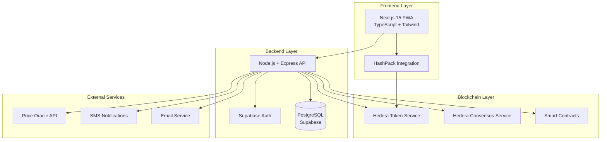

# Design Document

## Overview

MazaoChain is a decentralized lending platform built on Hedera that enables small farmers in the DRC to tokenize their future crops and use them as collateral for micro-credits. The system uses a three-tier architecture with Next.js frontend, Node.js backend, and Hedera blockchain integration, supporting three user roles: farmers (Agriculteur), cooperatives (Coopérative), and institutional lenders (Prêteur).

## Architecture

### High-Level Architecture



### Technology Stack

- **Frontend**: Next.js 15, TypeScript, Tailwind CSS, PWA capabilities
- **Backend**: Node.js, Express, TypeScript
- **Database**: PostgreSQL with Supabase (auth, storage, realtime)
- **Blockchain**: Hedera (HTS, HCS, Smart Contracts)
- **Wallet**: HashPack SDK integration
- **External APIs**: Manual price oracle (transitioning to Chainlink)

## Components and Interfaces

### 1. Authentication & User Management

#### User Roles and Permissions
```typescript
enum UserRole {
  AGRICULTEUR = 'agriculteur',
  COOPERATIVE = 'cooperative', 
  PRETEUR = 'preteur'
}

interface User {
  id: string;
  email: string;
  role: UserRole;
  walletAddress?: string;
  profile: FarmerProfile | CooperativeProfile | LenderProfile;
  isValidated: boolean;
  createdAt: Date;
}
```

#### HashPack Wallet Integration
- Wallet connection and association with user profiles
- Transaction signing for token operations
- Balance queries for USDC and MazaoTokens

### 2. Crop Evaluation System

#### Evaluation Engine
```typescript
interface CropEvaluation {
  id: string;
  farmerId: string;
  cropType: 'manioc' | 'cafe';
  superficie: number; // in hectares
  rendementHistorique: number; // kg per hectare
  prixReference: number; // USDC per kg
  valeurEstimee: number; // calculated value
  status: 'pending' | 'approved' | 'rejected';
  createdAt: Date;
}

// Calculation: superficie × rendement × prix référence
const calculateCropValue = (evaluation: CropEvaluation): number => {
  return evaluation.superficie * evaluation.rendementHistorique * evaluation.prixReference;
};
```

#### PDF Report Generation
- Automated report generation with evaluation details
- Multilingual support (Lingala/French)
- Digital signatures for authenticity

### 3. Tokenization Module

#### Smart Contract Architecture

```solidity
// MazaoTokenFactory.sol
contract MazaoTokenFactory {
    mapping(address => uint256) public farmerTokenBalances;
    mapping(uint256 => CropData) public cropTokens;
    
    struct CropData {
        address farmer;
        uint256 estimatedValue;
        string cropType;
        uint256 harvestDate;
        bool isActive;
    }
    
    function createCropToken(
        address farmerId, 
        uint256 estimatedValue,
        string memory cropType
    ) external returns (uint256 tokenId);
    
    function mintTokens(address farmerAddress, uint256 amount) external;
    function burnTokens(address farmerAddress, uint256 amount) external;
}
```

#### Token Management
- Automatic minting upon crop evaluation approval
- Token association with farmer wallets
- Portfolio tracking and balance management

### 4. Lending System

#### Loan Management Smart Contract

```solidity
// LoanManager.sol
contract LoanManager {
    struct Loan {
        address borrower;
        uint256 principal;
        uint256 collateralAmount;
        uint256 interestRate;
        uint256 dueDate;
        LoanStatus status;
    }
    
    enum LoanStatus { PENDING, ACTIVE, REPAID, DEFAULTED }
    
    mapping(uint256 => Loan) public loans;
    uint256 public constant COLLATERAL_RATIO = 200; // 200% collateralization
    
    function createLoan(
        address farmerAddress, 
        uint256 loanAmount
    ) external returns (uint256 loanId);
    
    function repayLoan(uint256 loanId) external;
    function liquidateCollateral(uint256 loanId) external;
}
```

#### Loan Workflow
1. **Loan Request**: Farmer specifies desired amount
2. **Collateral Check**: System verifies 200% coverage
3. **Cooperative Approval**: Manual review and approval
4. **Fund Disbursement**: Automatic USDC transfer
5. **Repayment Tracking**: Monitor due dates and payments

### 5. Cooperative Management Interface

#### Validation Dashboard
- Pending farmer profile reviews
- Crop evaluation approvals
- Loan request assessments
- Risk analysis tools

#### Approval Workflows
```typescript
interface ApprovalRequest {
  id: string;
  type: 'profile' | 'evaluation' | 'loan';
  farmerId: string;
  data: any;
  status: 'pending' | 'approved' | 'rejected';
  reviewedBy?: string;
  reviewedAt?: Date;
  comments?: string;
}
```

### 6. Lender Interface

#### Investment Dashboard
- Available loan opportunities
- Risk assessment metrics
- Portfolio performance tracking
- Automated fund distribution

#### Risk Assessment
```typescript
interface RiskMetrics {
  farmerCreditScore: number;
  cropHistoricalYield: number;
  marketPriceVolatility: number;
  collateralizationRatio: number;
  overallRiskRating: 'LOW' | 'MEDIUM' | 'HIGH';
}
```

## Data Models

### Core Entities

```typescript
// Farmer Profile
interface FarmerProfile {
  userId: string;
  nom: string;
  superficie: number;
  culturesHistoriques: CropHistory[];
  localisation: string;
  cooperativeId: string;
  isValidated: boolean;
}

// Cooperative Profile  
interface CooperativeProfile {
  userId: string;
  nom: string;
  region: string;
  membersCount: number;
  validatedFarmers: string[];
}

// Lender Profile
interface LenderProfile {
  userId: string;
  institutionName: string;
  availableFunds: number;
  investmentCriteria: InvestmentCriteria;
  activeLoans: string[];
}

// Transaction Records
interface Transaction {
  id: string;
  type: 'mint' | 'burn' | 'loan' | 'repayment';
  fromAddress: string;
  toAddress: string;
  amount: number;
  tokenType: 'MAZAO' | 'USDC';
  hederaTransactionId: string;
  timestamp: Date;
}
```

### Database Schema

```sql
-- Users table (managed by Supabase Auth)
CREATE TABLE profiles (
  id UUID REFERENCES auth.users PRIMARY KEY,
  role user_role NOT NULL,
  wallet_address TEXT,
  is_validated BOOLEAN DEFAULT FALSE,
  created_at TIMESTAMP DEFAULT NOW()
);

-- Crop evaluations
CREATE TABLE crop_evaluations (
  id UUID PRIMARY KEY DEFAULT gen_random_uuid(),
  farmer_id UUID REFERENCES profiles(id),
  crop_type TEXT NOT NULL,
  superficie DECIMAL NOT NULL,
  rendement_historique DECIMAL NOT NULL,
  prix_reference DECIMAL NOT NULL,
  valeur_estimee DECIMAL NOT NULL,
  status TEXT DEFAULT 'pending',
  created_at TIMESTAMP DEFAULT NOW()
);

-- Loans
CREATE TABLE loans (
  id UUID PRIMARY KEY DEFAULT gen_random_uuid(),
  borrower_id UUID REFERENCES profiles(id),
  lender_id UUID REFERENCES profiles(id),
  principal DECIMAL NOT NULL,
  collateral_amount DECIMAL NOT NULL,
  interest_rate DECIMAL NOT NULL,
  due_date TIMESTAMP NOT NULL,
  status TEXT DEFAULT 'pending',
  created_at TIMESTAMP DEFAULT NOW()
);
```

## Error Handling

### Blockchain Error Management
- Transaction failure recovery mechanisms
- Gas fee estimation and management
- Network connectivity issues handling
- Smart contract interaction error handling

### Application Error Handling
```typescript
class MazaoChainError extends Error {
  constructor(
    public code: string,
    public message: string,
    public details?: any
  ) {
    super(message);
  }
}

// Error types
enum ErrorCodes {
  INSUFFICIENT_COLLATERAL = 'INSUFFICIENT_COLLATERAL',
  WALLET_NOT_CONNECTED = 'WALLET_NOT_CONNECTED',
  EVALUATION_PENDING = 'EVALUATION_PENDING',
  TRANSACTION_FAILED = 'TRANSACTION_FAILED',
  UNAUTHORIZED_ACCESS = 'UNAUTHORIZED_ACCESS'
}
```

### User Experience Error Handling
- Graceful degradation for offline scenarios
- Clear error messages in Lingala
- Retry mechanisms for failed transactions
- Fallback options for critical operations

## Testing Strategy

### Unit Testing
- Smart contract testing with Hardhat
- API endpoint testing with Jest
- Component testing with React Testing Library
- Database operation testing

### Integration Testing
- End-to-end user workflows
- Blockchain integration testing
- Third-party service integration
- Cross-browser compatibility testing

### Security Testing
- Smart contract auditing
- Penetration testing
- Authentication and authorization testing
- Data encryption validation

### Performance Testing
- Load testing for concurrent users
- Transaction throughput testing
- Mobile performance optimization
- Database query optimization

### Test Coverage Requirements
- Minimum 80% code coverage
- 100% coverage for critical financial operations
- Smart contract formal verification
- Security vulnerability scanning

## Deployment and Infrastructure

### Environment Configuration
- Development: Local Hedera testnet
- Staging: Hedera testnet with production-like data
- Production: Hedera mainnet with full security measures

### Monitoring and Logging
- Application performance monitoring
- Blockchain transaction monitoring
- Error tracking and alerting
- User analytics and behavior tracking

### Backup and Recovery
- Database backup strategies
- Smart contract upgrade mechanisms
- Disaster recovery procedures
- Data migration capabilities