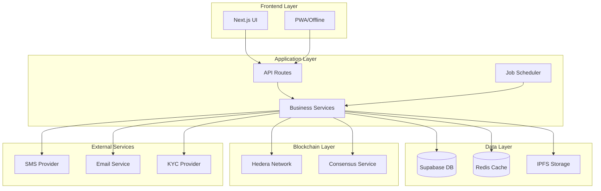

# Design Document - Complétion des Politiques et Workflows MazaoChain

## Overview

Ce document décrit l'architecture et la conception technique pour compléter l'implémentation des politiques et workflows de MazaoChain. La solution s'appuie sur l'infrastructure existante (Next.js, Supabase, Hedera) et ajoute les fonctionnalités manquantes de manière modulaire et évolutive.

### Objectifs de Conception

1. **Extensibilité**: Ajouter les nouvelles fonctionnalités sans perturber le code existant
2. **Performance**: Utiliser des jobs programmés et des workers pour les tâches asynchrones
3. **Fiabilité**: Implémenter des mécanismes de retry et de fallback
4. **Sécurité**: Renforcer la protection des données et l'authentification
5. **Traçabilité**: Enregistrer toutes les opérations critiques sur blockchain

## Architecture

### Architecture Globale



### Nouveaux Composants

#### 1. Grace Period Manager
Gère la période de grâce de 15 jours et les notifications programmées.

```typescript
class GracePeriodManager {
  - GRACE_PERIOD_DAYS = 15
  - LATE_FEE_RATE = 0.001 // 0.1% per day
  
  + checkGracePeriodStatus(loanId: string): GracePeriodStatus
  + calculateLateFees(loanId: string): number
  + scheduleGracePeriodNotifications(loanId: string): void
  + processExpiredGracePeriods(): void
}
```

#### 2. Notification Scheduler
Planifie et envoie les notifications multi-canal (SMS, Email, In-app).

```typescript
class NotificationScheduler {
  + scheduleNotification(notification: ScheduledNotification): void
  + sendMultiChannelNotification(userId: string, message: NotificationMessage): void
  + retryFailedNotifications(): void
  + getNotificationPreferences(userId: string): NotificationPreferences
}
```

#### 3. Quality Factor Calculator
Calcule le facteur qualité (0.8-1.2) basé sur les pratiques agricoles.

```typescript
class QualityFactorCalculator {
  + calculateQualityFactor(practices: AgriculturalPractices): number
  + evaluateOrganicPractices(data: OrganicData): number
  + evaluateIrrigation(data: IrrigationData): number
  + evaluateEquipment(data: EquipmentData): number
  + evaluateHistoricalYield(yields: number[]): number
}
```

#### 4. Credit Score Engine
Calcule et met à jour le score de crédit des agriculteurs.

```typescript
class CreditScoreEngine {
  + calculateCreditScore(farmerId: string): CreditScore
  + updateScoreOnRepayment(loanId: string, onTime: boolean): void
  + getScoreFactors(farmerId: string): ScoreFactor[]
  + determineLoanLimits(creditScore: number): LoanLimits
  + determineInterestRate(creditScore: number): number
}
```

#### 5. Margin Call Manager
Gère les appels de marge quand le collatéral baisse.

```typescript
class MarginCallManager {
  - MARGIN_CALL_THRESHOLD = 1.5 // 150%
  - PRICE_DROP_ALERT_THRESHOLD = 0.15 // 15%
  
  + monitorCollateralValues(): void
  + triggerMarginCall(loanId: string): void
  + processMarginCallResponse(loanId: string, additionalCollateral: number): void
  + alertPriceDrops(): void
}
```

#### 6. Liquidation Manager
Gère le processus de liquidation graduelle sur 30 jours.

```typescript
class LiquidationManager {
  + initiateLiquidation(loanId: string): LiquidationProcess
  + processLiquidationPhase(processId: string): void
  + negotiateRestructuring(loanId: string, proposal: RestructuringProposal): void
  + executeFinalLiquidation(loanId: string): void
  + sellOnSecondaryMarket(tokenId: string): void
}
```

#### 7. Fee Manager
Gère les frais de service et leur répartition.

```typescript
class FeeManager {
  - SERVICE_FEE_RATE = 0.02 // 2%
  - PLATFORM_SHARE = 0.012 // 1.2%
  - COOPERATIVE_SHARE = 0.006 // 0.6%
  - RESERVE_SHARE = 0.002 // 0.2%
  
  + calculateServiceFees(loanAmount: number): FeeBreakdown
  + distributeServiceFees(loanId: string, fees: FeeBreakdown): void
  + calculateLateFees(loanId: string, daysLate: number): number
  + calculateLiquidationFees(liquidationAmount: number): number
}
```

#### 8. Encryption Service
Gère le chiffrement AES-256 des données sensibles.

```typescript
class EncryptionService {
  + encryptData(data: string, key: string): string
  + decryptData(encryptedData: string, key: string): string
  + hashDocument(document: Buffer): string
  + storeOnIPFS(document: Buffer): IPFSHash
  + verifyDocumentHash(document: Buffer, hash: string): boolean
}
```

#### 9. Two-Factor Auth Service
Gère l'authentification à deux facteurs.

```typescript
class TwoFactorAuthService {
  + enableTwoFactor(userId: string): TwoFactorSetup
  + verifyTwoFactorCode(userId: string, code: string): boolean
  + generateBackupCodes(userId: string): string[]
  + sendVerificationCode(userId: string, method: 'sms' | 'email'): void
}
```

#### 10. KYC/AML Service
Gère la vérification KYC/AML pour les prêts > 1,000$.

```typescript
class KYCAMLService {
  - KYC_THRESHOLD = 1000 // $1,000
  
  + requiresKYC(loanAmount: number): boolean
  + initiateKYCVerification(userId: string): KYCProcess
  + checkKYCStatus(userId: string): KYCStatus
  + submitKYCDocuments(userId: string, documents: Document[]): void
  + verifyIdentity(userId: string): VerificationResult
}
```

#### 11. Dispute Resolution Service
Gère le processus de résolution des litiges.

```typescript
class DisputeResolutionService {
  + createDispute(dispute: DisputeData): Dispute
  + escalateDispute(disputeId: string, nextLevel: DisputeLevel): void
  + recordDecision(disputeId: string, decision: Decision): void
  + placeInEscrow(disputeId: string, amount: number): void
  + releaseEscrow(disputeId: string, recipient: string): void
  + generateDisputeReport(disputeId: string): Report
}
```

## Components and Interfaces

### Database Schema Extensions

#### 1. Grace Period Tracking

```sql
-- Add grace period fields to loans table
ALTER TABLE loans ADD COLUMN grace_period_start TIMESTAMP;
ALTER TABLE loans ADD COLUMN grace_period_end TIMESTAMP;
ALTER TABLE loans ADD COLUMN late_fees_accumulated DECIMAL DEFAULT 0;
ALTER TABLE loans ADD COLUMN days_overdue INTEGER DEFAULT 0;
```

#### 2. Scheduled Notifications

```sql
CREATE TABLE scheduled_notifications (
  id UUID PRIMARY KEY DEFAULT gen_random_uuid(),
  user_id UUID REFERENCES profiles(id) ON DELETE CASCADE,
  loan_id UUID REFERENCES loans(id) ON DELETE CASCADE,
  notification_type TEXT NOT NULL,
  scheduled_for TIMESTAMP NOT NULL,
  sent_at TIMESTAMP,
  status TEXT DEFAULT 'pending', -- pending, sent, failed, cancelled
  retry_count INTEGER DEFAULT 0,
  channels JSONB, -- ['sms', 'email', 'in_app']
  message_data JSONB,
  created_at TIMESTAMP DEFAULT NOW()
);

CREATE INDEX idx_scheduled_notifications_scheduled_for 
  ON scheduled_notifications(scheduled_for) 
  WHERE status = 'pending';
```

#### 3. Quality Factors

```sql
CREATE TABLE agricultural_practices (
  id UUID PRIMARY KEY DEFAULT gen_random_uuid(),
  farmer_id UUID REFERENCES profiles(id) ON DELETE CASCADE,
  evaluation_id UUID REFERENCES crop_evaluations(id),
  is_organic BOOLEAN DEFAULT false,
  has_irrigation BOOLEAN DEFAULT false,
  equipment_quality TEXT, -- basic, intermediate, advanced
  soil_management_score DECIMAL, -- 0-10
  pest_control_method TEXT, -- organic, chemical, integrated
  historical_yields JSONB, -- Array of last 3 years yields
  quality_factor DECIMAL, -- Calculated 0.8-1.2
  created_at TIMESTAMP DEFAULT NOW(),
  updated_at TIMESTAMP DEFAULT NOW()
);
```

#### 4. Credit Scores

```sql
CREATE TABLE credit_scores (
  id UUID PRIMARY KEY DEFAULT gen_random_uuid(),
  farmer_id UUID REFERENCES profiles(id) ON DELETE CASCADE,
  score INTEGER, -- 0-100
  on_time_payments INTEGER DEFAULT 0,
  late_payments INTEGER DEFAULT 0,
  defaults INTEGER DEFAULT 0,
  total_borrowed DECIMAL DEFAULT 0,
  total_repaid DECIMAL DEFAULT 0,
  account_age_days INTEGER DEFAULT 0,
  last_calculated TIMESTAMP DEFAULT NOW(),
  factors JSONB, -- Detailed breakdown
  created_at TIMESTAMP DEFAULT NOW(),
  updated_at TIMESTAMP DEFAULT NOW()
);

CREATE INDEX idx_credit_scores_farmer ON credit_scores(farmer_id);
```

#### 5. Margin Calls

```sql
CREATE TABLE margin_calls (
  id UUID PRIMARY KEY DEFAULT gen_random_uuid(),
  loan_id UUID REFERENCES loans(id) ON DELETE CASCADE,
  triggered_at TIMESTAMP DEFAULT NOW(),
  collateral_value_at_trigger DECIMAL,
  required_additional_collateral DECIMAL,
  deadline TIMESTAMP, -- 7 days from trigger
  status TEXT DEFAULT 'pending', -- pending, fulfilled, expired
  additional_collateral_added DECIMAL DEFAULT 0,
  resolved_at TIMESTAMP,
  created_at TIMESTAMP DEFAULT NOW()
);
```

#### 6. Liquidation Processes

```sql
CREATE TABLE liquidation_processes (
  id UUID PRIMARY KEY DEFAULT gen_random_uuid(),
  loan_id UUID REFERENCES loans(id) ON DELETE CASCADE,
  initiated_at TIMESTAMP DEFAULT NOW(),
  current_phase TEXT, -- grace, negotiation, liquidation, completed
  phase_deadline TIMESTAMP,
  negotiation_proposals JSONB,
  liquidation_amount DECIMAL,
  recovery_amount DECIMAL,
  completed_at TIMESTAMP,
  status TEXT DEFAULT 'active', -- active, resolved, completed
  created_at TIMESTAMP DEFAULT NOW()
);
```

#### 7. Service Fees

```sql
CREATE TABLE service_fees (
  id UUID PRIMARY KEY DEFAULT gen_random_uuid(),
  loan_id UUID REFERENCES loans(id) ON DELETE CASCADE,
  fee_type TEXT, -- service, late, liquidation
  total_amount DECIMAL,
  platform_share DECIMAL,
  cooperative_share DECIMAL,
  reserve_share DECIMAL,
  collected_at TIMESTAMP DEFAULT NOW(),
  distributed BOOLEAN DEFAULT false,
  created_at TIMESTAMP DEFAULT NOW()
);
```

#### 8. Encrypted Data

```sql
CREATE TABLE encrypted_user_data (
  id UUID PRIMARY KEY DEFAULT gen_random_uuid(),
  user_id UUID REFERENCES profiles(id) ON DELETE CASCADE,
  data_type TEXT, -- identity, financial, personal
  encrypted_data TEXT, -- AES-256 encrypted
  encryption_key_id TEXT, -- Reference to key management system
  created_at TIMESTAMP DEFAULT NOW(),
  updated_at TIMESTAMP DEFAULT NOW()
);
```

#### 9. Two-Factor Auth

```sql
CREATE TABLE two_factor_auth (
  id UUID PRIMARY KEY DEFAULT gen_random_uuid(),
  user_id UUID REFERENCES profiles(id) ON DELETE CASCADE,
  enabled BOOLEAN DEFAULT false,
  secret TEXT, -- TOTP secret
  backup_codes JSONB, -- Array of backup codes
  last_used TIMESTAMP,
  created_at TIMESTAMP DEFAULT NOW()
);
```

#### 10. KYC Verifications

```sql
CREATE TABLE kyc_verifications (
  id UUID PRIMARY KEY DEFAULT gen_random_uuid(),
  user_id UUID REFERENCES profiles(id) ON DELETE CASCADE,
  status TEXT DEFAULT 'pending', -- pending, approved, rejected
  verification_level TEXT, -- basic, enhanced
  documents_submitted JSONB,
  verified_at TIMESTAMP,
  verified_by UUID REFERENCES profiles(id),
  rejection_reason TEXT,
  created_at TIMESTAMP DEFAULT NOW()
);
```

#### 11. Disputes

```sql
CREATE TABLE disputes (
  id UUID PRIMARY KEY DEFAULT gen_random_uuid(),
  loan_id UUID REFERENCES loans(id),
  initiated_by UUID REFERENCES profiles(id),
  dispute_type TEXT, -- repayment, evaluation, liquidation
  current_level TEXT, -- support, cooperative, arbitration, legal
  status TEXT DEFAULT 'open', -- open, in_progress, resolved, closed
  description TEXT,
  escrow_amount DECIMAL,
  decisions JSONB, -- Array of decisions at each level
  resolved_at TIMESTAMP,
  resolution TEXT,
  created_at TIMESTAMP DEFAULT NOW(),
  deadline TIMESTAMP -- 30 days from creation
);
```

#### 12. IPFS Document Hashes

```sql
CREATE TABLE document_hashes (
  id UUID PRIMARY KEY DEFAULT gen_random_uuid(),
  user_id UUID REFERENCES profiles(id) ON DELETE CASCADE,
  document_type TEXT, -- identity, evaluation, contract
  ipfs_hash TEXT NOT NULL,
  file_hash TEXT NOT NULL, -- SHA-256 hash
  file_size BIGINT,
  mime_type TEXT,
  created_at TIMESTAMP DEFAULT NOW()
);
```

### API Endpoints

#### Grace Period & Notifications

```typescript
// GET /api/loans/:loanId/grace-period
// Returns grace period status and late fees

// POST /api/notifications/schedule
// Schedule a notification for future delivery

// GET /api/notifications/scheduled
// Get all scheduled notifications for a user
```

#### Quality Factors & Evaluation

```typescript
// POST /api/evaluations/:id/practices
// Submit agricultural practices for quality factor calculation

// GET /api/evaluations/:id/quality-factor
// Get calculated quality factor

// POST /api/evaluations/:id/documents
// Upload evaluation documents to IPFS
```

#### Credit Score

```typescript
// GET /api/farmers/:id/credit-score
// Get farmer's credit score and factors

// GET /api/farmers/:id/loan-limits
// Get loan limits based on credit score
```

#### Margin Calls

```typescript
// GET /api/loans/:loanId/margin-call
// Get margin call status

// POST /api/loans/:loanId/add-collateral
// Add additional collateral to meet margin call
```

#### Liquidation

```typescript
// POST /api/loans/:loanId/liquidation/initiate
// Initiate liquidation process

// POST /api/loans/:loanId/liquidation/negotiate
// Submit restructuring proposal

// GET /api/loans/:loanId/liquidation/status
// Get liquidation process status
```

#### Security

```typescript
// POST /api/auth/2fa/enable
// Enable two-factor authentication

// POST /api/auth/2fa/verify
// Verify 2FA code

// POST /api/kyc/initiate
// Initiate KYC verification

// POST /api/kyc/documents
// Submit KYC documents
```

#### Disputes

```typescript
// POST /api/disputes/create
// Create a new dispute

// POST /api/disputes/:id/escalate
// Escalate dispute to next level

// POST /api/disputes/:id/decision
// Record a decision
```

## Data Models

### Grace Period Status

```typescript
interface GracePeriodStatus {
  loanId: string;
  isInGracePeriod: boolean;
  gracePeriodStart: Date;
  gracePeriodEnd: Date;
  daysRemaining: number;
  lateFees: number;
  daysOverdue: number;
}
```

### Quality Factor

```typescript
interface QualityFactor {
  evaluationId: string;
  factor: number; // 0.8 - 1.2
  breakdown: {
    organicPractices: number;
    irrigation: number;
    equipment: number;
    soilManagement: number;
    pestControl: number;
    historicalYield: number;
  };
}
```

### Credit Score

```typescript
interface CreditScore {
  farmerId: string;
  score: number; // 0-100
  factors: {
    paymentHistory: number;
    creditUtilization: number;
    accountAge: number;
    totalRepaid: number;
    defaults: number;
  };
  loanLimits: {
    maxAmount: number;
    interestRate: number;
  };
  lastUpdated: Date;
}
```

### Margin Call

```typescript
interface MarginCall {
  id: string;
  loanId: string;
  triggeredAt: Date;
  collateralValueAtTrigger: number;
  requiredAdditionalCollateral: number;
  deadline: Date;
  status: 'pending' | 'fulfilled' | 'expired';
  additionalCollateralAdded: number;
}
```

### Liquidation Process

```typescript
interface LiquidationProcess {
  id: string;
  loanId: string;
  initiatedAt: Date;
  currentPhase: 'grace' | 'negotiation' | 'liquidation' | 'completed';
  phaseDeadline: Date;
  negotiationProposals: RestructuringProposal[];
  liquidationAmount: number;
  recoveryAmount: number;
  status: 'active' | 'resolved' | 'completed';
}
```

### Service Fees

```typescript
interface ServiceFees {
  loanId: string;
  feeType: 'service' | 'late' | 'liquidation';
  totalAmount: number;
  breakdown: {
    platformShare: number; // 1.2%
    cooperativeShare: number; // 0.6%
    reserveShare: number; // 0.2%
  };
  collectedAt: Date;
  distributed: boolean;
}
```

## Error Handling

### Grace Period Errors

```typescript
class GracePeriodError extends MazaoChainError {
  constructor(message: string, context?: ErrorContext) {
    super(ErrorCode.GRACE_PERIOD_ERROR, message, {
      ...context,
      userMessage: 'Erreur lors du traitement de la période de grâce'
    });
  }
}
```

### Notification Errors

```typescript
class NotificationError extends MazaoChainError {
  constructor(message: string, context?: ErrorContext) {
    super(ErrorCode.NOTIFICATION_ERROR, message, {
      ...context,
      userMessage: 'Erreur lors de l\'envoi de la notification'
    });
  }
}
```

### KYC Errors

```typescript
class KYCError extends MazaoChainError {
  constructor(message: string, context?: ErrorContext) {
    super(ErrorCode.KYC_ERROR, message, {
      ...context,
      userMessage: 'Erreur lors de la vérification KYC'
    });
  }
}
```

## Testing Strategy

### Unit Tests

1. **Grace Period Manager Tests**
   - Test grace period calculation
   - Test late fee calculation
   - Test notification scheduling

2. **Quality Factor Calculator Tests**
   - Test factor calculation with various inputs
   - Test boundary conditions (0.8 - 1.2)
   - Test historical yield averaging

3. **Credit Score Engine Tests**
   - Test score calculation algorithm
   - Test score updates on events
   - Test loan limit determination

4. **Fee Manager Tests**
   - Test service fee calculation and distribution
   - Test late fee calculation
   - Test liquidation fee calculation

### Integration Tests

1. **End-to-End Loan Lifecycle**
   - Create loan → Grace period → Late fees → Liquidation
   - Test notification delivery at each stage
   - Verify fee collection and distribution

2. **Margin Call Flow**
   - Price drop → Margin call trigger → Additional collateral → Resolution
   - Test alert notifications
   - Verify collateral value monitoring

3. **Liquidation Process**
   - Initiate → Negotiate → Execute → Complete
   - Test phase transitions
   - Verify fund distribution

4. **Dispute Resolution**
   - Create → Escalate → Resolve
   - Test escrow management
   - Verify decision recording on HCS

### Performance Tests

1. **Scheduled Job Performance**
   - Test notification scheduler with 1000+ scheduled notifications
   - Test grace period checker with 100+ active loans
   - Test margin call monitor with price updates

2. **Encryption Performance**
   - Test AES-256 encryption/decryption speed
   - Test IPFS upload/retrieval performance
   - Test hash verification speed

## Security Considerations

### Data Encryption

- All PII encrypted with AES-256 before storage
- Encryption keys managed via AWS KMS or similar
- Regular key rotation policy

### Authentication

- 2FA mandatory for transactions > 1,000$
- Session management with secure tokens
- Rate limiting on authentication endpoints

### Blockchain Security

- All critical operations recorded on HCS
- Document hashes stored on IPFS
- Smart contract audits for tokenization

### Access Control

- Role-based access control (RBAC)
- Row-level security (RLS) on all tables
- Audit logs for all sensitive operations

## Deployment Strategy

### Phase 1: Core Infrastructure (Week 1-2)
- Database schema extensions
- Encryption service
- 2FA service
- KYC service integration

### Phase 2: Grace Period & Notifications (Week 3-4)
- Grace period manager
- Notification scheduler
- Scheduled job workers
- Multi-channel notification delivery

### Phase 3: Quality & Credit (Week 5-6)
- Quality factor calculator
- Credit score engine
- Enhanced evaluation workflow
- Historical data migration

### Phase 4: Risk Management (Week 7-8)
- Margin call manager
- Liquidation manager
- Fee manager
- Reserve fund management

### Phase 5: Dispute Resolution (Week 9-10)
- Dispute resolution service
- Escrow management
- HCS integration for decisions
- Reporting and dashboards

### Phase 6: Testing & Optimization (Week 11-12)
- Comprehensive testing
- Performance optimization
- Security audit
- Documentation

## Monitoring and Observability

### Metrics to Track

1. **Grace Period Metrics**
   - Number of loans in grace period
   - Average late fees collected
   - Grace period expiration rate

2. **Notification Metrics**
   - Delivery success rate by channel
   - Average delivery time
   - Retry rate

3. **Credit Score Metrics**
   - Average credit score by cohort
   - Score distribution
   - Impact on loan approval rate

4. **Liquidation Metrics**
   - Liquidation initiation rate
   - Negotiation success rate
   - Recovery rate

### Alerts

- Grace period expiring without payment
- Notification delivery failures
- Margin call triggers
- Liquidation phase transitions
- KYC verification failures
- Dispute escalations

## Future Enhancements

1. **Machine Learning for Credit Scoring**
   - Predictive models for default risk
   - Personalized interest rates
   - Automated loan approval

2. **Secondary Market for MazaoTokens**
   - Token exchange platform
   - Liquidity pools
   - Price discovery mechanism

3. **Insurance Integration**
   - Automated weather insurance
   - Crop disease coverage
   - Smart contract-based claims

4. **Mobile App**
   - React Native application
   - Offline-first architecture
   - SMS fallback for critical operations

5. **Advanced Analytics**
   - Predictive analytics for harvest yields
   - Market price forecasting
   - Portfolio optimization for lenders
