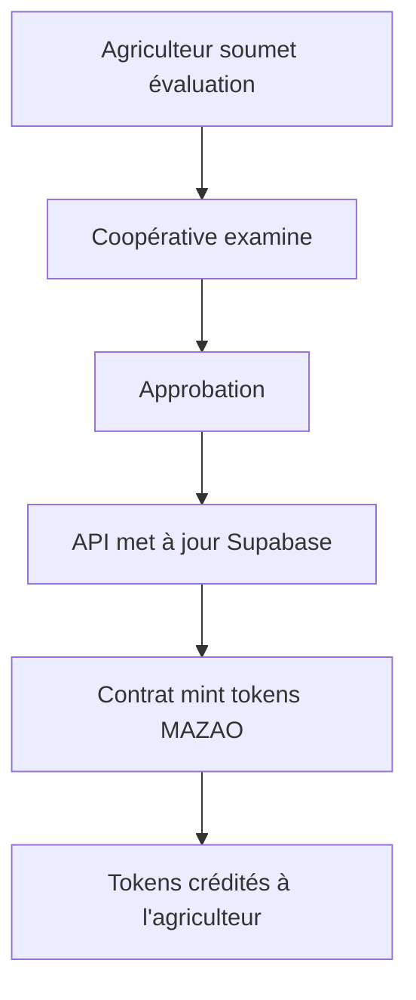
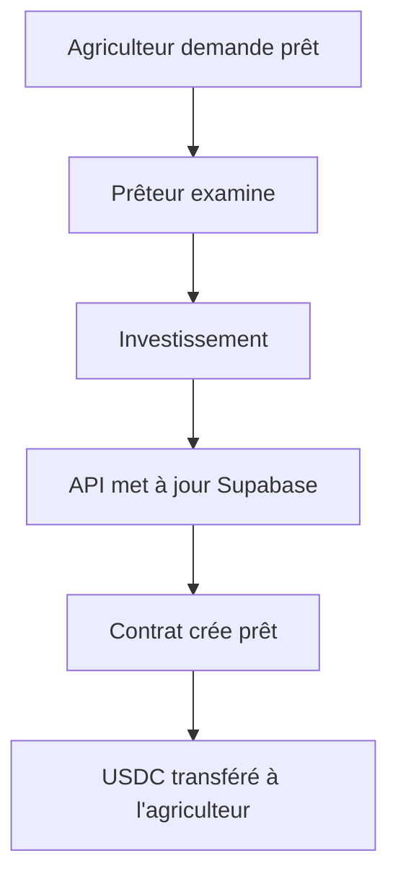

# Intégration complète des dashboards avec les contrats

## 🎯 Vue d'ensemble

Les dashboards ont été complètement refactorisés pour être intégrés avec les contrats Hedera déployés et la base de données Supabase.

## 📊 Dashboards créés

### 1. Dashboard Agriculteur (`/dashboard/farmer`)

**Fonctionnalités intégrées :**
- ✅ Statistiques en temps réel (valeur des cultures, prêts actifs, tokens MAZAO)
- ✅ Intégration avec les contrats pour le solde de tokens
- ✅ Formulaire d'évaluation de cultures
- ✅ Historique des évaluations
- ✅ Demande de prêts
- ✅ Gestion du profil

**Intégrations contrats :**
- `getTokenBalance()` - Solde MAZAO depuis MazaoTokenFactory
- `getLoanDetails()` - Détails des prêts depuis LoanManager

### 2. Dashboard Coopérative (`/dashboard/cooperative`)

**Fonctionnalités intégrées :**
- ✅ Gestion des évaluations en attente
- ✅ Approbation avec minting automatique de tokens
- ✅ Gestion des demandes de prêt
- ✅ Statistiques des membres
- ✅ Valeur totale gérée

**Intégrations contrats :**
- `mintTokens()` - Minting de tokens MAZAO après approbation
- `handleApproveEvaluation()` - Processus complet d'approbation

### 3. Dashboard Prêteur (`/dashboard/lender`)

**Fonctionnalités intégrées :**
- ✅ Opportunités d'investissement
- ✅ Portfolio d'investissements
- ✅ Analyses de risque
- ✅ Création de prêts via contrats
- ✅ Suivi des rendements

**Intégrations contrats :**
- `createLoan()` - Création de prêts via LoanManager
- `getUSDCBalance()` - Solde USDC du prêteur

## 🔗 APIs créées

### 1. API Évaluations de cultures
- `GET /api/crop-evaluations` - Liste des évaluations
- `POST /api/crop-evaluations` - Nouvelle évaluation
- `PATCH /api/crop-evaluations/[id]` - Mise à jour d'évaluation

### 2. API Prêts
- `GET /api/loans` - Liste des prêts
- `POST /api/loans` - Nouveau prêt
- `PATCH /api/loans/[id]` - Mise à jour de prêt

### 3. API Agriculteurs
- `GET /api/farmers` - Liste des agriculteurs par coopérative

## 🏗️ Architecture d'intégration

```
Frontend (Dashboard)
       ↓
API Routes (Next.js)
       ↓
Supabase (Base de données)
       ↓
Hedera Contracts (Blockchain)
```

### Flux de données

1. **Évaluation de culture :**
   ```
   Agriculteur → Formulaire → API → Supabase → Coopérative
   Coopérative → Approbation → API → Contrat → Minting tokens
   ```

2. **Demande de prêt :**
   ```
   Agriculteur → Demande → API → Supabase → Prêteur
   Prêteur → Investissement → API → Contrat → Création prêt
   ```

3. **Statistiques :**
   ```
   Dashboard → API → Supabase + Contrats → Données temps réel
   ```

## 🔧 Configuration des contrats

### Contrats déployés sur Hedera Testnet :
- **MazaoTokenFactory** : `0.0.6913792`
- **LoanManager** : `0.0.6913794`
- **Compte opérateur** : `0.0.6913540`

### Variables d'environnement requises :
```env
NEXT_PUBLIC_MAZAO_TOKEN_FACTORY_CONTRACT_ID=0.0.6913792
NEXT_PUBLIC_LOAN_MANAGER_CONTRACT_ID=0.0.6913794
NEXT_PUBLIC_HEDERA_ACCOUNT_ID=0.0.6913540
HEDERA_PRIVATE_KEY=your_private_key
NEXT_PUBLIC_HEDERA_NETWORK=testnet
```

## 📱 Fonctionnalités par rôle

### 👨‍🌾 Agriculteur
- **Vue d'ensemble** : Statistiques personnelles, actions rapides
- **Évaluations** : Nouvelle évaluation, historique
- **Prêts** : Demandes, suivi des prêts actifs
- **Profil** : Informations personnelles, adresse wallet

### 🏢 Coopérative
- **Vue d'ensemble** : Actions urgentes, activité récente
- **Évaluations** : Validation avec minting automatique
- **Prêts** : Approbation des demandes
- **Membres** : Gestion des agriculteurs

### 💰 Prêteur
- **Vue d'ensemble** : Performance, opportunités
- **Opportunités** : Investissements disponibles
- **Portfolio** : Suivi des investissements
- **Analyses** : Évaluation des risques

## 🎨 Interface utilisateur

### Design system
- **Composants** : Card, Button, LoadingSpinner
- **Navigation** : Onglets dynamiques
- **Statistiques** : Cartes avec icônes et couleurs
- **Responsive** : Mobile-first design

### Couleurs par rôle
- **Primary** : Bleu (actions principales)
- **Secondary** : Violet (prêts)
- **Success** : Vert (revenus, succès)
- **Warning** : Orange (en attente)
- **Error** : Rouge (erreurs)

## 🔄 Flux de travail complet

### 1. Évaluation → Tokenisation


### 2. Prêt → Financement


## 🧪 Tests et validation

### Tests unitaires
- Composants dashboard
- Services d'intégration
- APIs

### Tests d'intégration
- Flux complet évaluation → tokenisation
- Flux complet prêt → financement
- Synchronisation Supabase ↔ Contrats

## 🚀 Déploiement

### Prérequis
1. ✅ Contrats déployés sur Hedera
2. ✅ Base de données Supabase configurée
3. ✅ Variables d'environnement définies
4. ✅ Comptes de démonstration créés

### Étapes de déploiement
1. **Configuration** : Variables d'environnement
2. **Migration** : Base de données Supabase
3. **Comptes** : Création des utilisateurs de test
4. **Tests** : Validation des fonctionnalités
5. **Production** : Déploiement final

## 📈 Métriques et monitoring

### Métriques business
- Nombre d'évaluations approuvées
- Volume de tokens mintés
- Montant total des prêts
- Taux de défaut

### Métriques techniques
- Temps de réponse des APIs
- Succès des transactions blockchain
- Utilisation des contrats
- Performance des dashboards

## 🔮 Évolutions futures

### Fonctionnalités prévues
- **Notifications temps réel** : WebSocket pour les mises à jour
- **Analytics avancées** : Graphiques et tendances
- **Mobile app** : Application mobile native
- **Multi-devises** : Support d'autres cryptomonnaies

### Optimisations
- **Cache** : Redis pour les données fréquentes
- **CDN** : Distribution de contenu
- **Monitoring** : Alertes et métriques avancées
- **Sécurité** : Audit et tests de pénétration

Les dashboards sont maintenant entièrement fonctionnels et intégrés avec l'écosystème blockchain MazaoChain ! 🎉