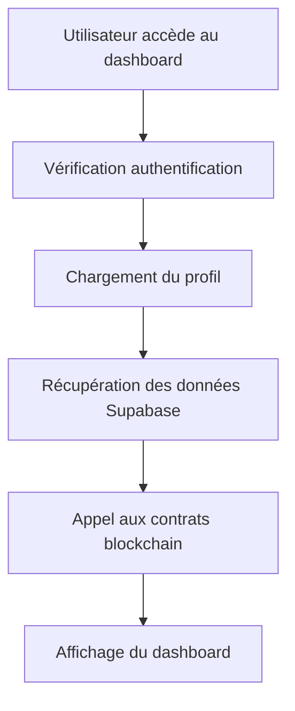
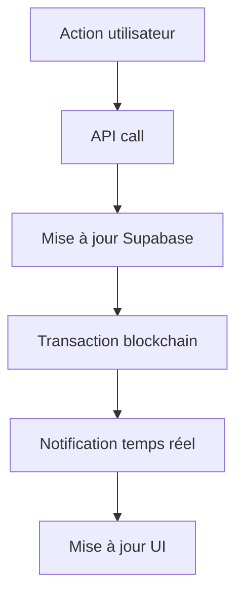

# Dashboards MazaoChain

## 🎯 Vue d'ensemble

Les dashboards MazaoChain offrent une interface complète et intégrée pour tous les acteurs de l'écosystème agricole décentralisé.

## 📊 Dashboards disponibles

### 1. Dashboard Agriculteur (`/dashboard/farmer`)

Interface dédiée aux agriculteurs pour gérer leurs cultures et prêts.

**Fonctionnalités :**
- 📈 **Statistiques personnelles** : Valeur des cultures, prêts actifs, tokens MAZAO
- 🌾 **Gestion des évaluations** : Soumission et suivi des évaluations de cultures
- 💰 **Demandes de prêt** : Création et suivi des demandes de financement
- 👤 **Profil** : Gestion des informations personnelles et wallet

**Intégrations blockchain :**
- Solde de tokens MAZAO en temps réel
- Historique des transactions
- Statut des prêts sur la blockchain

### 2. Dashboard Coopérative (`/dashboard/cooperative`)

Interface pour les coopératives agricoles gérant leurs membres.

**Fonctionnalités :**
- 👥 **Gestion des membres** : Suivi des agriculteurs affiliés
- ✅ **Validation des évaluations** : Approbation avec minting automatique de tokens
- 🏦 **Gestion des prêts** : Approbation des demandes de financement
- 📊 **Statistiques globales** : Vue d'ensemble de l'activité

**Intégrations blockchain :**
- Minting automatique de tokens MAZAO
- Validation des garanties
- Suivi des performances

### 3. Dashboard Prêteur (`/dashboard/lender`)

Interface pour les investisseurs et institutions financières.

**Fonctionnalités :**
- 🎯 **Opportunités d'investissement** : Découverte de prêts disponibles
- 💼 **Portfolio** : Suivi des investissements et rendements
- 📈 **Analyses de risque** : Évaluation des opportunités
- 💰 **Gestion des fonds** : Suivi des liquidités disponibles

**Intégrations blockchain :**
- Création de prêts via smart contracts
- Suivi des remboursements
- Calcul automatique des intérêts

## 🏗️ Architecture technique

### Structure des composants
```
src/app/[lang]/dashboard/
├── farmer/
│   └── page.tsx          # Dashboard agriculteur
├── cooperative/
│   └── page.tsx          # Dashboard coopérative
├── lender/
│   └── page.tsx          # Dashboard prêteur
└── page.tsx              # Dashboard général
```

### Composants partagés
```
src/components/
├── dashboard/
│   ├── DashboardLayout.tsx
│   └── DashboardNavigation.tsx
├── crop-evaluation/
│   ├── CropEvaluationForm.tsx
│   └── EvaluationHistory.tsx
├── loan/
│   ├── LoanRequestForm.tsx
│   └── LoanDashboard.tsx
└── ui/
    ├── Card.tsx
    ├── Button.tsx
    └── LoadingSpinner.tsx
```

## 🔗 Intégrations

### APIs REST
- `GET /api/crop-evaluations` - Évaluations de cultures
- `GET /api/loans` - Prêts et financements
- `GET /api/farmers` - Agriculteurs par coopérative

### Services blockchain
- `mazaoContractsService` - Interaction avec les smart contracts
- `useMazaoContracts` - Hook React pour les contrats
- `useAuth` - Authentification et profils utilisateur

### Base de données
- **Supabase** - Stockage des données métier
- **Real-time** - Mises à jour en temps réel
- **RLS** - Sécurité au niveau des lignes

## 🎨 Design system

### Couleurs par contexte
- **Primary** (`text-primary-600`) - Actions principales, navigation
- **Secondary** (`text-secondary-600`) - Prêts, financement
- **Success** (`text-success-600`) - Revenus, approbations
- **Warning** (`text-warning-600`) - En attente, alertes
- **Error** (`text-error-600`) - Erreurs, rejets

### Composants UI
- **Card** - Conteneurs de contenu avec ombre
- **Button** - Boutons avec variantes (primary, secondary, outline)
- **LoadingSpinner** - Indicateurs de chargement
- **Navigation** - Onglets et menus

## 📱 Responsive design

### Breakpoints
- **Mobile** : `< 768px` - Layout vertical, navigation simplifiée
- **Tablet** : `768px - 1024px` - Grille 2 colonnes
- **Desktop** : `> 1024px` - Grille complète, sidebar

### Adaptations mobiles
- Navigation par onglets en bas
- Cartes empilées verticalement
- Formulaires optimisés pour le tactile
- Graphiques redimensionnés

## 🔄 Flux de données

### Chargement initial


### Mise à jour temps réel


## 🧪 Tests

### Tests unitaires
```bash
npm run test src/app/[lang]/dashboard/
```

### Tests d'intégration
```bash
npm run test:integration
```

### Tests E2E
```bash
npm run test:e2e
```

## 🚀 Déploiement

### Variables d'environnement
```env
# Contrats Hedera
NEXT_PUBLIC_MAZAO_TOKEN_FACTORY_CONTRACT_ID=0.0.6913792
NEXT_PUBLIC_LOAN_MANAGER_CONTRACT_ID=0.0.6913794

# Configuration Hedera
NEXT_PUBLIC_HEDERA_ACCOUNT_ID=0.0.6913540
NEXT_PUBLIC_HEDERA_NETWORK=testnet
HEDERA_PRIVATE_KEY=your_private_key

# Supabase
NEXT_PUBLIC_SUPABASE_URL=your_supabase_url
NEXT_PUBLIC_SUPABASE_ANON_KEY=your_supabase_key
```

### Build et déploiement
```bash
# Build de production
npm run build

# Démarrage
npm run start

# Ou développement
npm run dev
```

## 📊 Métriques

### Performance
- **Time to Interactive** : < 3s
- **First Contentful Paint** : < 1.5s
- **Cumulative Layout Shift** : < 0.1

### Business
- Nombre d'évaluations traitées
- Volume de tokens mintés
- Montant total des prêts
- Taux de conversion

## 🔮 Roadmap

### Version 1.1
- [ ] Notifications push
- [ ] Graphiques avancés
- [ ] Export de données
- [ ] Mode sombre

### Version 1.2
- [ ] Application mobile
- [ ] Intégration multi-devises
- [ ] Analytics prédictives
- [ ] API publique

### Version 2.0
- [ ] Marketplace de cultures
- [ ] Assurance décentralisée
- [ ] Gouvernance DAO
- [ ] Cross-chain

## 🆘 Support

### Documentation
- [Guide utilisateur](../../../docs/user-guide.md)
- [API Reference](../../../docs/api-reference.md)
- [Troubleshooting](../../../docs/troubleshooting.md)

### Contact
- **Email** : support@mazaochain.com
- **Discord** : [MazaoChain Community](https://discord.gg/mazaochain)
- **GitHub** : [Issues](https://github.com/mazaochain/issues)

Les dashboards MazaoChain offrent une expérience utilisateur complète et intégrée pour l'écosystème agricole décentralisé ! 🌾✨